# Git
---
## What is Version Control

Version of Git Installed on Classroom Workspace

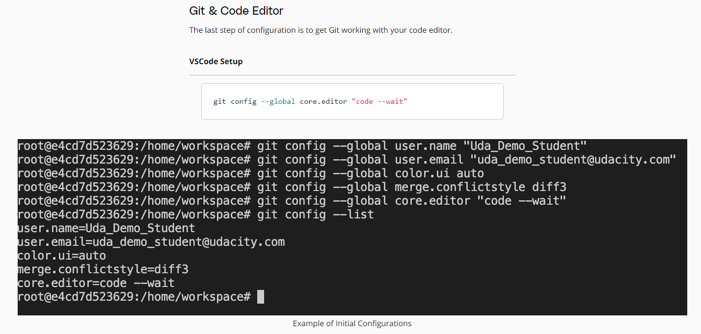

## Create a Git repo

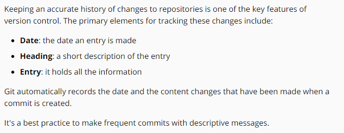

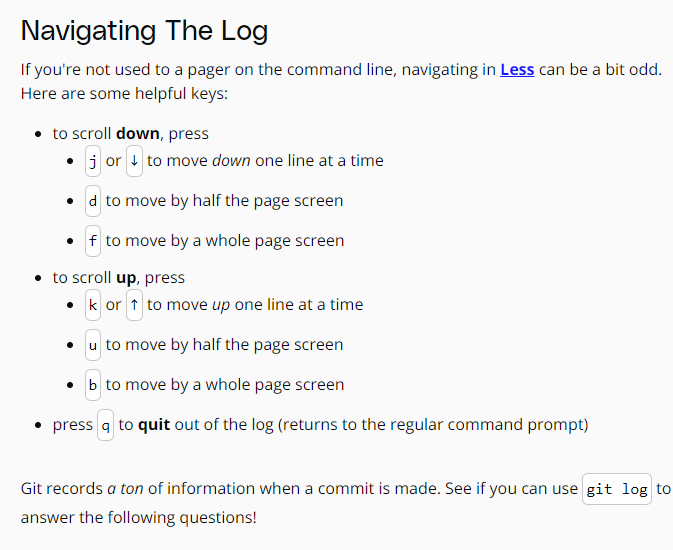

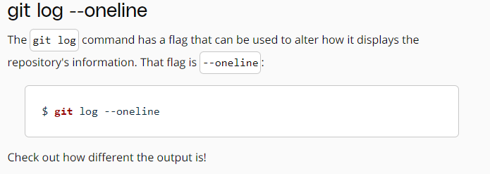

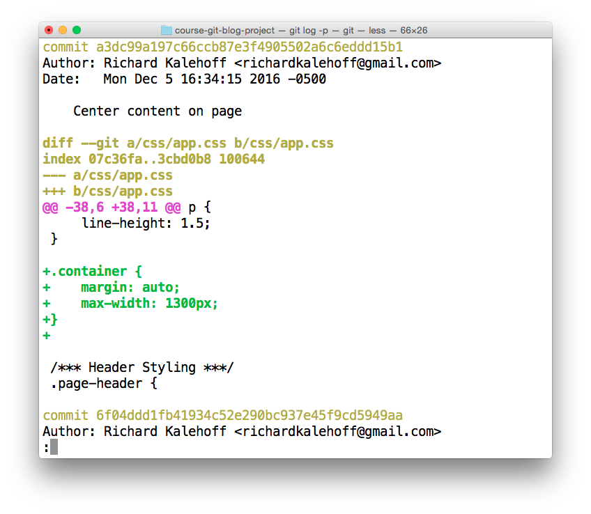

## Commits, Tags, Conflicts

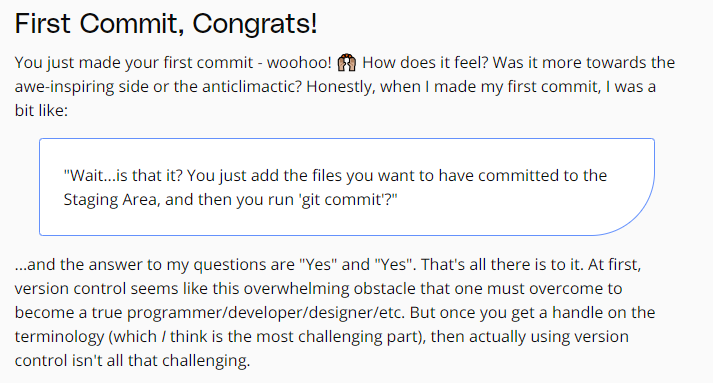

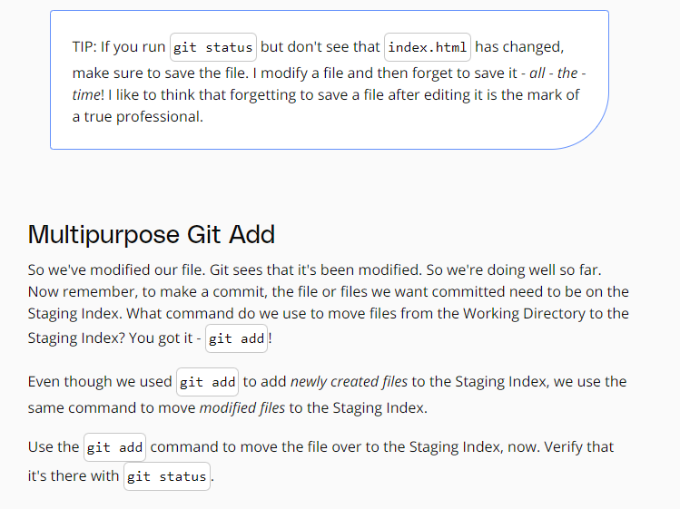

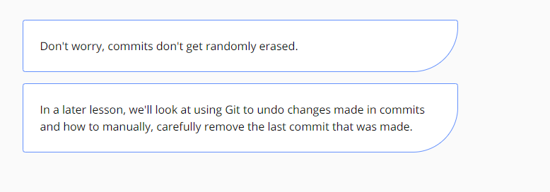

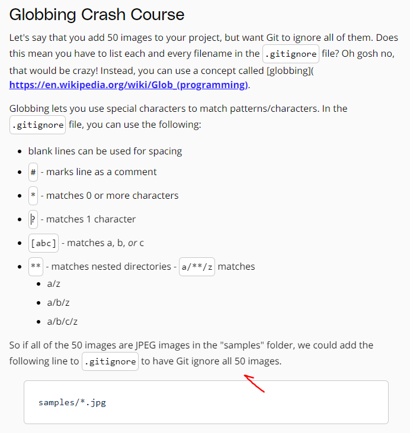

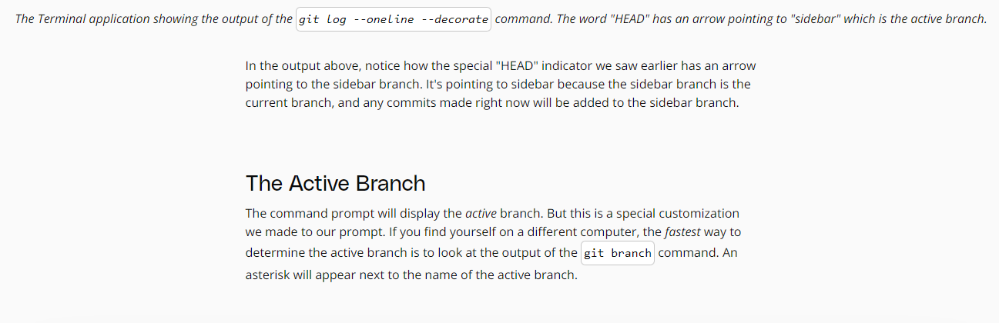

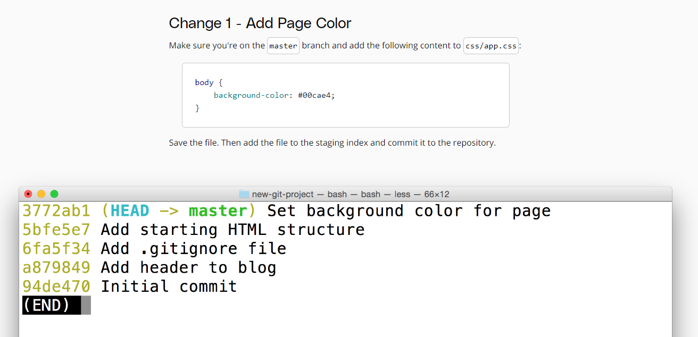

The Terminal application showing the output of git log --oneline --decorate --graph --all. Both the master branch and the heading-update branch alter the same line of the same file.

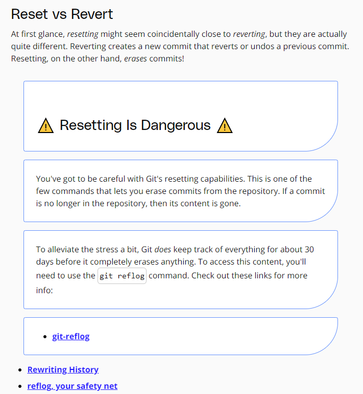

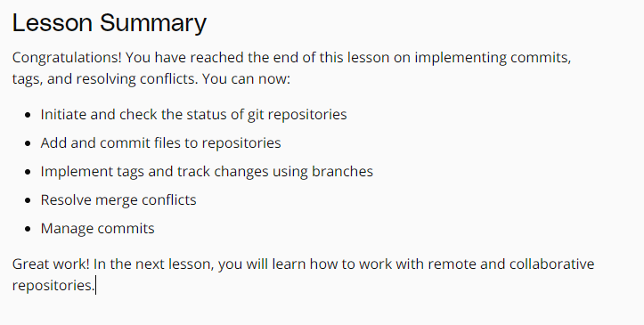

You're also not limited to just one remote. You can add as many remote repositories as you want!

A local repository can be connected to more than one remote repository.

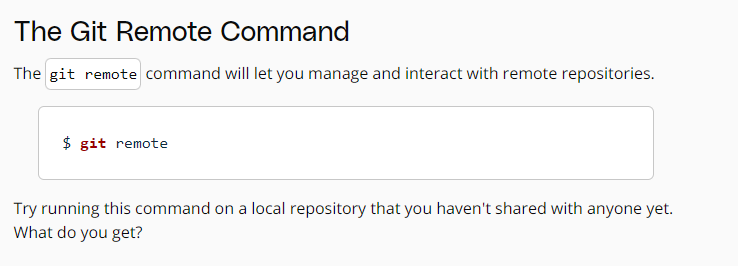

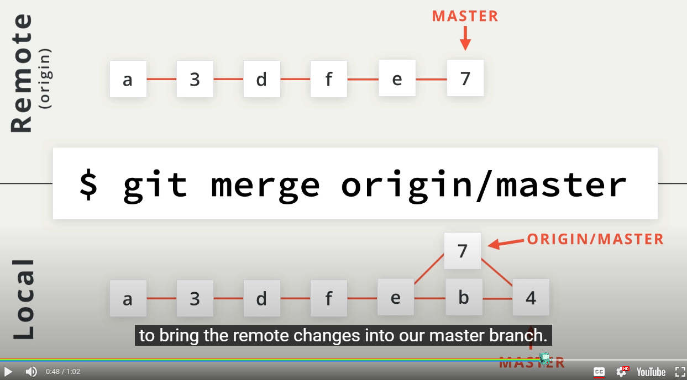

Let's take a look at the name of the repository:

The terminal application showing the result of running git log --author=Surma. The output displays only the commits that Surma made.

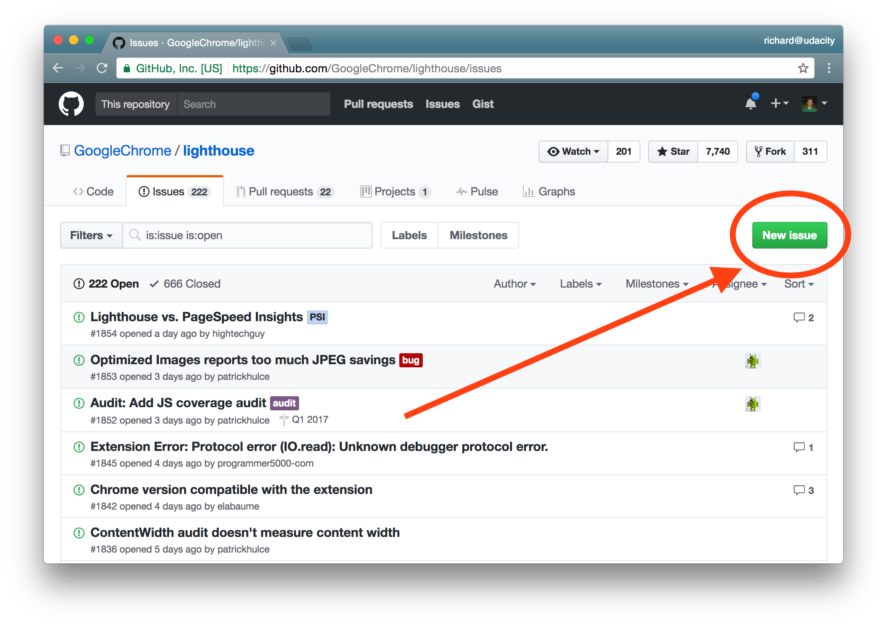

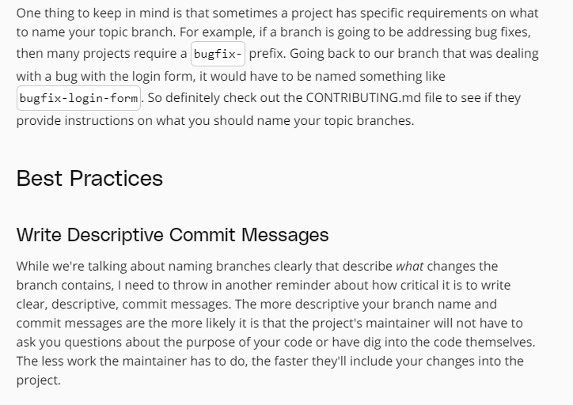

The terminal application showing the results of doing git fetch upstream master. A new branch is added to the local repository.

## Documentation in Exciting

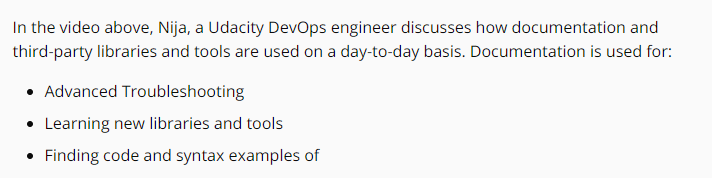

