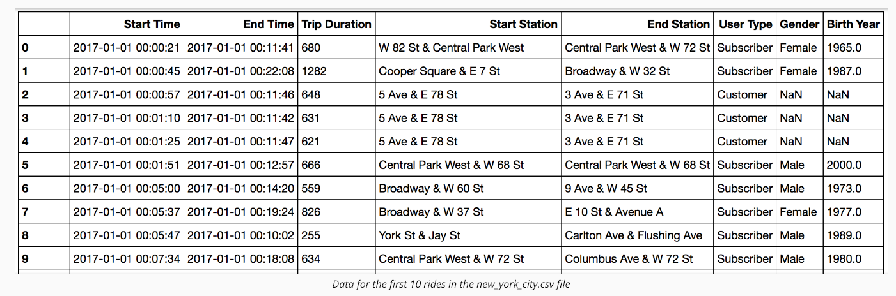
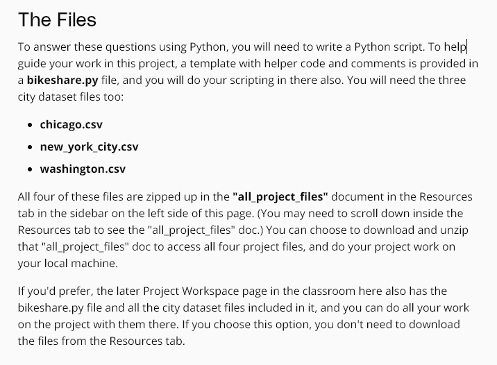
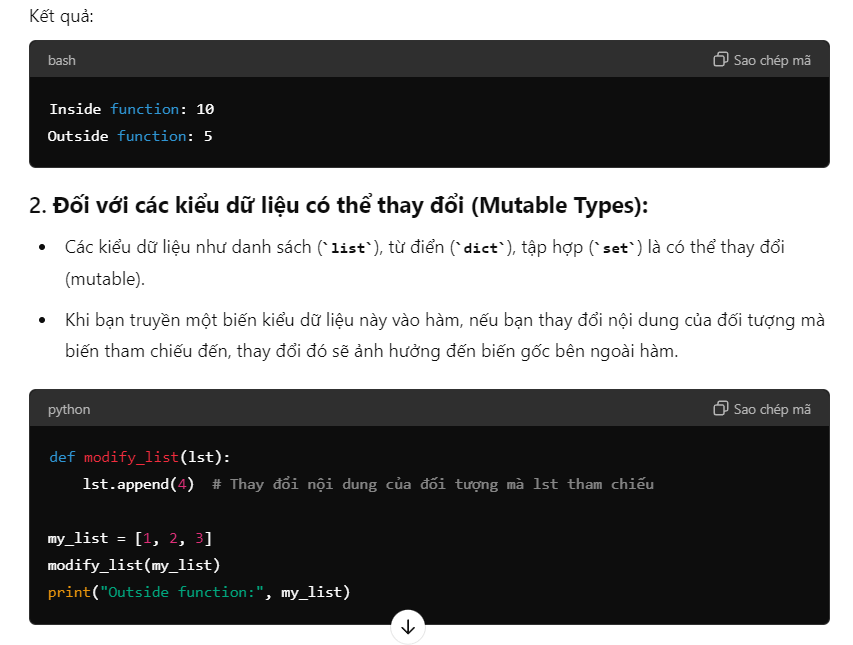
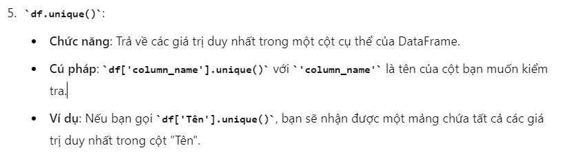
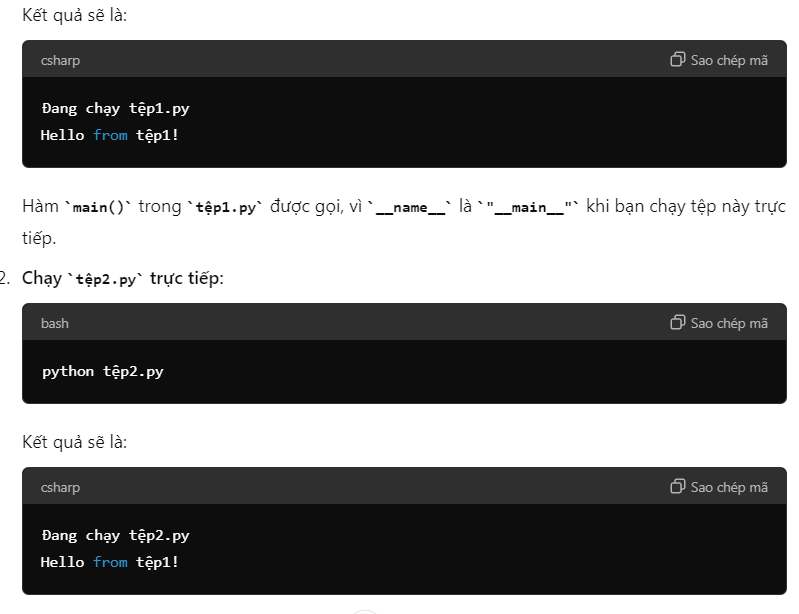

# Project 2
---








```Python
import pandas as pd

CITY_DATA = { 'chicago': 'chicago.csv',
              'new york city': 'new_york_city.csv',
              'washington': 'washington.csv' }

def load_data(city, month, day):
    """
    Loads data for the specified city and filters by month and day if applicable.

    Args:
        (str) city - name of the city to analyze
        (str) month - name of the month to filter by, or "all" to apply no month filter
        (str) day - name of the day of week to filter by, or "all" to apply no day filter
    Returns:
        df - Pandas DataFrame containing city data filtered by month and day
    """
    
    # load data file into a dataframe
    df = pd.read_csv(CITY_DATA[city])

    # convert the Start Time column to datetime
    df['Start Time'] = pd.to_datetime(df['Start Time'])

    # extract month and day of week from Start Time to create new columns
    df['month'] = df['Start Time'].dt.month
    df['day_of_week'] = df['Start Time'].dt.weekday_name

    # filter by month if applicable
    if month != 'all':
        # use the index of the months list to get the corresponding int
        months = ['january', 'february', 'march', 'april', 'may', 'june']
        month = months.index(month) + 1
    
        # filter by month to create the new dataframe
        df = df[df['month'] == month]

    # filter by day of week if applicable
    if day != 'all':
        # filter by day of week to create the new dataframe
        df = df[df['day_of_week'] == day.title()]
    
    return df
```











To get user input for a city with a while loop to handle invalid inputs, you can use the following code:
```Python
# List of valid cities
valid_cities = ["chicago", "new york city", "washington"]

# Function to get user input
def get_city():
    while True:
        city = input("Please enter a city (Chicago, New York City, Washington): ").strip().lower()
        if city in valid_cities:
            return city
        else:
            print("Invalid input. Please try again.")

# Get the city from the user
selected_city = get_city()
print(f"You selected: {selected_city.capitalize()}")
```


```Python
# List of valid cities, months, and days
valid_cities = ["chicago", "new york city", "washington"]
valid_months = ["january", "february", "march", "april", "may", "june", "all"]
valid_days = ["monday", "tuesday", "wednesday", "thursday", "friday", "saturday", "sunday", "all"]

# Function to get valid input
def get_input(prompt, valid_options):
    while True:
        user_input = input(prompt).strip().lower()
        if user_input in valid_options:
            return user_input
        else:
            print("Invalid input. Please try again.")

# Get user input for city
city = get_input("Please enter a city (Chicago, New York City, Washington): ", valid_cities)
print(f"You selected city: {city.capitalize()}")

# Get user input for month
month = get_input("Please enter a month (all, January, February, ..., June): ", valid_months)
print(f"You selected month: {month.capitalize()}")

# Get user input for day of the week
day = get_input("Please enter a day of the week (all, Monday, Tuesday, ..., Sunday): ", valid_days)
print(f"You selected day: {day.capitalize()}")
```


