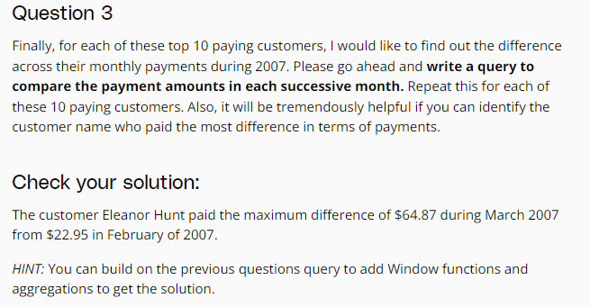
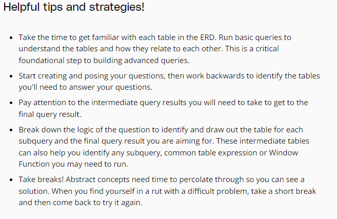

# Project1
---
## Project Overview

## Project Details


## Workspace vs. Local environment


## Set Up Your Local Environment

## Composite Key


## Workspace: DVD Rental Database

## Practice Solution #1

Dấu ``` bị thừa


## Practice Solution #2


```SQL
SELECT    DISTINCT(filmlen_groups),
          COUNT(title) OVER (PARTITION BY filmlen_groups) AS filmcount_bylencat
FROM  
         (SELECT title,length,
      	CASE WHEN length <= 60 THEN '1 hour or less'
      	WHEN length > 60 AND length <= 120 THEN 'Between 1-2 hours'
      	WHEN length > 120 AND length <= 180 THEN 'Between 2-3 hours'
      	ELSE 'More than 3 hours' END AS filmlen_groups
          FROM film ) t1
ORDER BY  filmlen_groups
```
## Workspace + Question Set #1


## Workspace + Question Set #2



## Template for Project Submission


## Common Mistakes

```SQL
SELECT count(film_id)
FROM inventory```

- This returns 1 row, with the count of film_id in the table.

If a column in the select statement is not in the Group By statement your results will be something you are not expecting. Please be careful of this!

### Subqueries
Subqueries are awesome but you should not use one if you do not need it to answer the question you asked. Many times the first question that is thought of does not require one. You may need to think of a few more to find a complex question that necessitates a subquery. 

 **Think of using a subquery when a SQL query is nested within another query. You need it to further restrict the returned data, so give careful thought to where.** 


### Window Functions
Window Functions are extremely  **useful for creating an aggregation or doing any other calculation across a subset of rows.** Once you have completed the calculation across the subset of rows, you can then reference the calculation as a new column in the query. You are required to use a window function in your query for this project. 

Think about when you need to aggregate across a subset of rows within a larger data table resulting from a query.
 


### Joins
Joins in general should be from a Primary Key to its corresponding Foreign Key.

Correct:
```ON inventory.inventory_id = rental.inventory_id```
- Here, Inventory PrimaryKey = Inventory ForeignKey
___
Incorrect: 
```ON inventory.inventory_id = rental.rental_id```
- Here, Inventory PrimaryKey does not equal Rental PrimaryKey


### Understanding the data
The Rentals table captures the rental history of the inventory of movie titles. Keep this in mind in case you are trying to show which movie has the most rentals. You would have to show which movie has the most copies or inventory rented out.
```
## Helpful strategies

# Project Rubric (tiêu chí dự án)


## Knowledge

