# Python
---
## Overview


## Data types and operators


Although the **last** two of these would **work** in Python, they are not pythonic ways to name variables.


```Python
verse = "If you can keep your head when all about you\n  Are losing theirs and blaming it on you,\nIf you can trust yourself when all men doubt you,\n  But make allowance for their doubting too;\nIf you can wait and not be tired by waiting,\n  Or being lied about, don’t deal in lies,\nOr being hated, don’t give way to hating,\n  And yet don’t look too good, nor talk too wise:"
print(verse, "\n")

print("Verse has a length of {} characters.".format(len(verse)))
print("The first occurence of the word 'and' occurs at the {}th index.".format(verse.find('and')))
print("The last occurence of the word 'you' occurs at the {}th index.".format(verse.rfind('you')))
print("The word 'you' occurs {} times in the verse.".format(verse.count('you')))
```
Here's another way you could write the print statements and get the same output. Recall that a string is an ordered datatype, and therefore, each item can be called by a location, and a location is each character.
```Python
verse = "If you can keep your head when all about you\n  Are losing theirs and blaming it on you,\nIf you can trust yourself when all men doubt you,\n  But make allowance for their doubting too;\nIf you can wait and not be tired by waiting,\n  Or being lied about, don’t deal in lies,\nOr being hated, don’t give way to hating,\n  And yet don’t look too good, nor talk too wise:"
print(verse, "\n")

message = "Verse has a length of {} characters.\nThe first occurence of the \
word 'and' occurs at the {}th index.\nThe last occurence of the word 'you' \
occurs at the {}th index.\nThe word 'you' occurs {} times in the verse."

length = len(verse)
first_idx = verse.find('and')
last_idx = verse.rfind('you')
count = verse.count('you')

print(message.format(length, first_idx, last_idx, count))
```


## Data structures in python


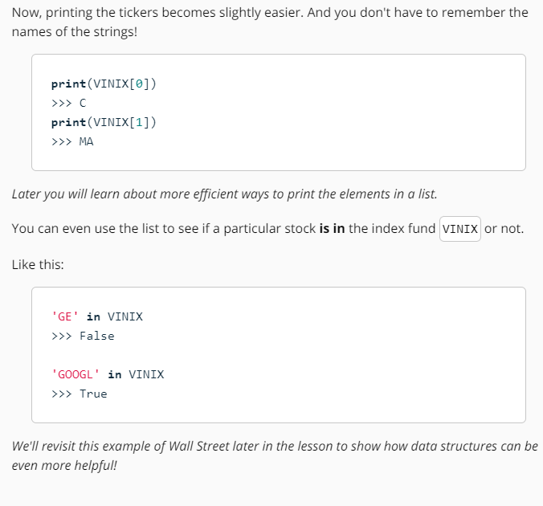


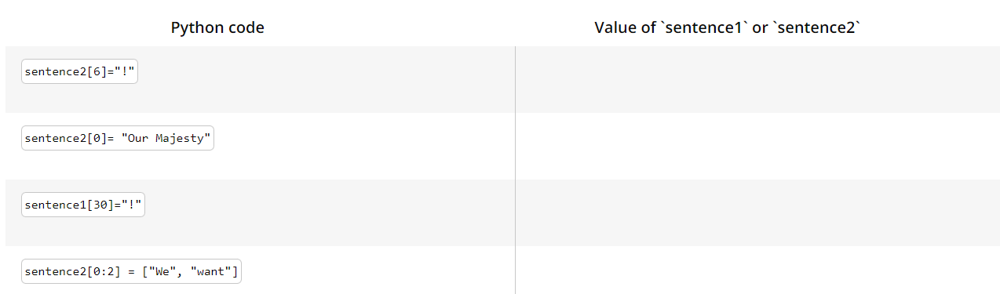
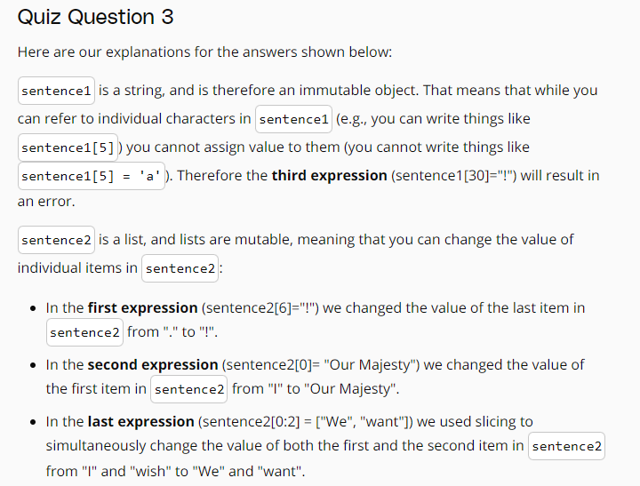


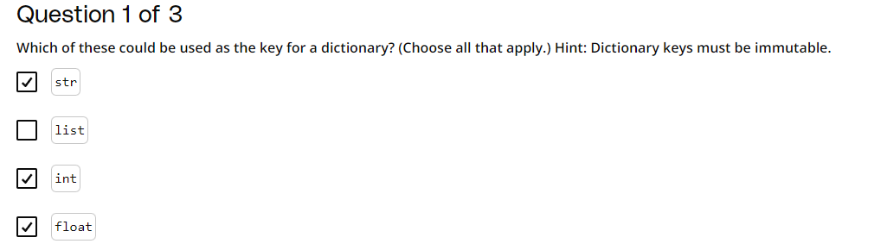


**Solution: Count Unique Words**
```Python
verse = "if you can keep your head when all about you are losing theirs and blaming it on you   if you can trust yourself when all men doubt you     but make allowance for their doubting too   if you can wait and not be tired by waiting      or being lied about  don’t deal in lies   or being hated  don’t give way to hating      and yet don’t look too good  nor talk too wise"
print(verse, "\n")

## split verse into list of words
verse_list = verse.split()
print(verse_list, '\n')

## convert list to set to get unique words
verse_set = set(verse_list)
print(verse_set, '\n')

## print the number of unique words
num_unique = len(verse_set)
print(num_unique)
```
Output
```Python
if you can keep your head when all about you are losing theirs and blaming it on you   if you can trust yourself when all men doubt you     but make allowance for their doubting too   if you can wait and not be tired by waiting      or being lied about  don’t deal in lies   or being hated  don’t give way to hating      and yet don’t look too good  nor talk too wise 

['if', 'you', 'can', 'keep', 'your', 'head', 'when', 'all', 'about', 'you', 'are', 'losing', 'theirs', 'and', 'blaming', 'it', 'on', 'you', 'if', 'you', 'can', 'trust', 'yourself', 'when', 'all', 'men', 'doubt', 'you', 'but', 'make', 'allowance', 'for', 'their', 'doubting', 'too', 'if', 'you', 'can', 'wait', 'and', 'not', 'be', 'tired', 'by', 'waiting', 'or', 'being', 'lied', 'about', 'don’t', 'deal', 'in', 'lies', 'or', 'being', 'hated', 'don’t', 'give', 'way', 'to', 'hating', 'and', 'yet', 'don’t', 'look', 'too', 'good', 'nor', 'talk', 'too', 'wise'] 

{'or', 'when', 'hating', 'make', 'all', 'head', 'waiting', 'losing', 'don’t', 'to', 'look', 'about', 'yourself', 'by', 'wise', 'doubting', 'trust', 'deal', 'allowance', 'being', 'too', 'wait', 'in', 'nor', 'for', 'theirs', 'and', 'if', 'on', 'lied', 'are', 'your', 'but', 'give', 'yet', 'lies', 'good', 'men', 'tired', 'doubt', 'hated', 'blaming', 'can', 'be', 'keep', 'their', 'not', 'it', 'talk', 'way', 'you'} 

51
```
**Solution: Verse Dictionary**
```Python
verse_dict =  {'if': 3, 'you': 6, 'can': 3, 'keep': 1, 'your': 1, 'head': 1, 'when': 2, 'all': 2, 'about': 2, 'are': 1, 'losing': 1, 'theirs': 1, 'and': 3, 'blaming': 1, 'it': 1, 'on': 1, 'trust': 1, 'yourself': 1, 'men': 1, 'doubt': 1, 'but': 1, 'make': 1, 'allowance': 1, 'for': 1, 'their': 1, 'doubting': 1, 'too': 3, 'wait': 1, 'not': 1, 'be': 1, 'tired': 1, 'by': 1, 'waiting': 1, 'or': 2, 'being': 2, 'lied': 1, 'don\'t': 3, 'deal': 1, 'in': 1, 'lies': 1, 'hated': 1, 'give': 1, 'way': 1, 'to': 1, 'hating': 1, 'yet': 1, 'look': 1, 'good': 1, 'nor': 1, 'talk': 1, 'wise': 1}
print(verse_dict, '\n')

## find number of unique keys in the dictionary
num_keys = len(verse_dict)
print(num_keys)

## find whether 'breathe' is a key in the dictionary
contains_breathe = "breathe" in verse_dict
print(contains_breathe)

## create and sort a list of the dictionary's keys
items = list(verse_dict.items())
def sort_by_value(item):
    return item[1]
items.sort(key=sort_by_value)
sorted_keys = [item[0] for item in items]

## An alternative solution is to use a lambda function
sorted_keys = [k for k, v in sorted(verse_dict.items(), key=lambda item: item[1])]

## get the first element in the sorted list of keys
print(sorted_keys[0])

## find the element with the highest value in the list of keys
print(sorted_keys[-1]) 
```
Output
```Python
{'make': 1, 'waiting': 1, 'tired': 1, 'when': 2, 'hating': 1, 'give': 1, 'talk': 1, 'losing': 1, 'look': 1, 'too': 3, 'doubting': 1, 'all': 2, 'be': 1, 'wait': 1, 'you': 6, 'it': 1, 'allowance': 1, 'being': 2, 'by': 1, 'for': 1, 'to': 1, 'men': 1, 'in': 1, 'can': 3, 'about': 2, 'are': 1, 'hated': 1, 'wise': 1, 'your': 1, 'yourself': 1, "don't": 3, 'good': 1, 'way': 1, 'keep': 1, 'if': 3, 'blaming': 1, 'nor': 1, 'but': 1, 'or': 2, 'on': 1, 'not': 1, 'deal': 1, 'trust': 1, 'doubt': 1, 'yet': 1, 'lied': 1, 'lies': 1, 'their': 1, 'theirs': 1, 'and': 3, 'head': 1} 

51
False
keep
you
```


## Control flow


```Python
#ALTERNATIVE SECOND PART OF SOLUTION
highest_count = max(win_count_dict.values())

most_win_director = [key for key, value in win_count_dict.items() if value == highest_count]
```

## Functions


```Python
def population_density(population, land_area):
    return population/land_area

# test cases for your function
test1 = population_density(10, 1)
expected_result1 = 10
print("expected result: {}, actual result: {}".format(expected_result1, test1))

test2 = population_density(864816, 121.4)
expected_result2 = 7123.6902801
print("expected result: {}, actual result: {}".format(expected_result2, test2))
```

```Python
def readable_timedelta(days):
    # use integer division to get the number of weeks
    weeks = days // 7
    # use % to get the number of days that remain
    remainder = days % 7
    return "{} week(s) and {} day(s).".format(weeks, remainder)

# test your function
print(readable_timedelta(10))
```


```Python
def some_function():
    print(word)

some_function()```
Notice that we can still access the value of the global variable `word` within this function. However, the value of a global variable can not be __modified__ inside the function. If you want to modify that variable's value inside this function, it should be passed in as an argument. You'll see more on this in the next quiz.

Scope is essential to understanding how information is passed throughout programs in Python and really any programming language.
```


```Python
def readable_timedelta(days):
    """Return a string of the number of weeks and days included in days."""
    weeks = days // 7
    remainder = days % 7
    return "{} week(s) and {} day(s)".format(weeks, remainder)
def readable_timedelta(days):
    """Return a string of the number of weeks and days included in days.

    Args:
        days (int): number of days to convert
    """
    weeks = days // 7
    remainder = days % 7
    return "{} week(s) and {} day(s)".format(weeks, remainder)
def readable_timedelta(days):
    """
    Return a string of the number of weeks and days included in days.

    Parameters:
    days -- number of days to convert (int)

    Returns:
    string of the number of weeks and days included in days
    """
    weeks = days // 7
    remainder = days % 7
    return "{} week(s) and {} day(s)".format(weeks, remainder)
```


## Scripting


```Python
names = input("Enter names separated by commas: ").title().split(",")
assignments = input("Enter assignment counts separated by commas: ").split(",")
grades = input("Enter grades separated by commas: ").split(",")

message = "Hi {},\n\nThis is a reminder that you have {} assignments left to \
submit before you can graduate. You're current grade is {} and can increase \
to {} if you submit all assignments before the due date.\n\n"

for name, assignment, grade in zip(names, assignments, grades):
    print(message.format(name, assignment, grade, int(grade) + int(assignment)*2))
```

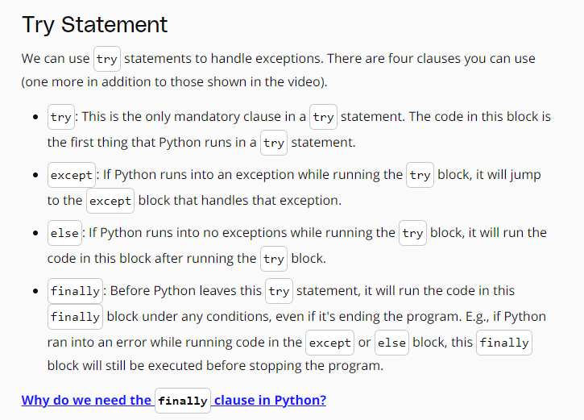


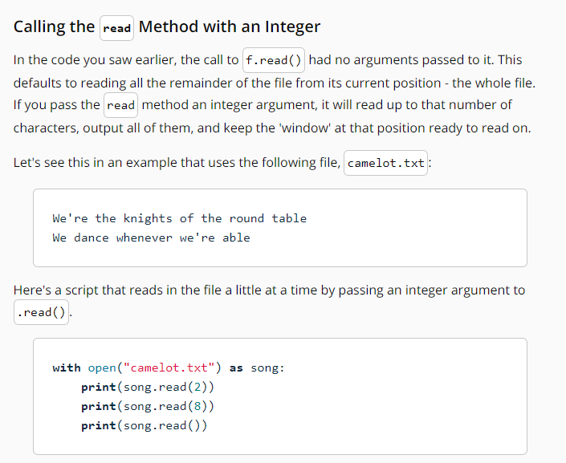


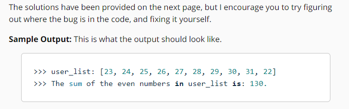

Here is my solution:
```Python
user_list = []
list_sum = 0
for i in range(10):
    userInput = int(input("Enter any number: "))
    try:
        user_list.append(userInput)
        if userInput % 2 == 0:
            list_sum += userInput
    except ValueError:
        print("Incorrect value. That's not an int!")
print("user_list: {}".format(user_list))
print("The sum of the even numbers in user_list is: {}.".format(list_sum))
```


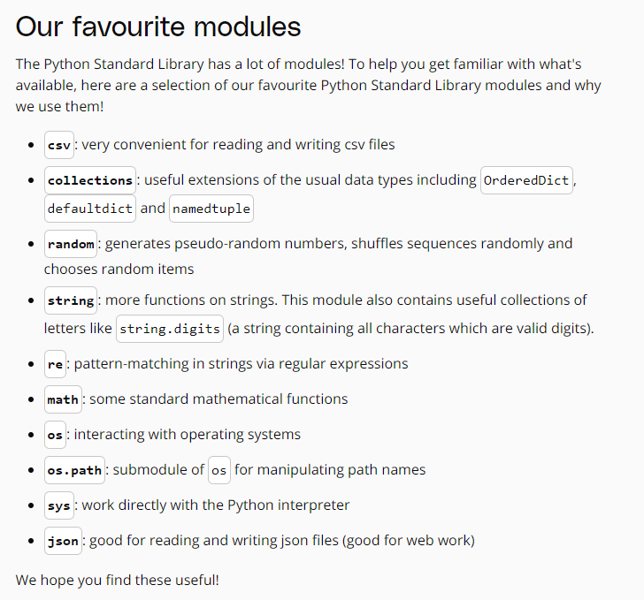


```Python
def generate_password():
    return random.choice(word_list) + random.choice(word_list) + random.choice(word_list)
```


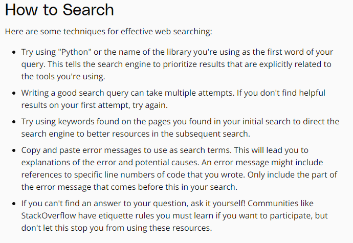


Quiz Solution:
Here's one way you can implement this program!
```Python
## function that creates a flower_dictionary from filename
def create_flowerdict(filename):
    flower_dict = {}
    with open(filename) as f:
        for line in f:
            letter = line.split(": ")[0].lower() 
            flower = line.split(": ")[1].strip()
            flower_dict[letter] = flower
    return flower_dict

## Main function that prompts for user input, parses out the first letter
## includes function call for create_flowerdict to create dictionary
def main(): 
    flower_d = create_flowerdict('flowers.txt')
    full_name = input("Enter your First [space] Last name only: ")
    first_name = full_name[0].lower()
    first_letter = first_name[0]
## print command that prints final input with value from corresponding key in dictionary
    print("Unique flower name with the first letter: {}".format(flower_d[first_letter]))

main()
```
## Numpy


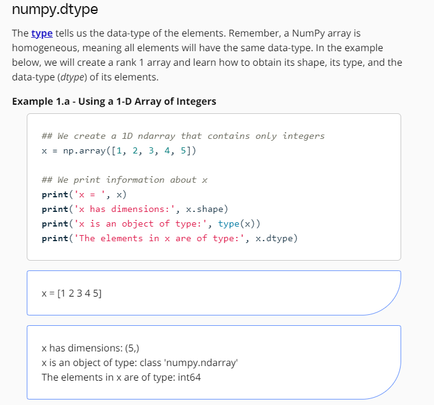


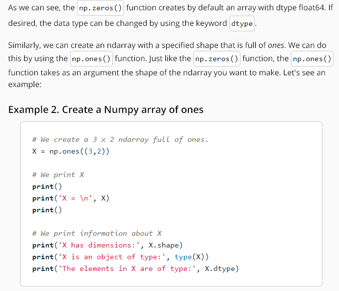


```Python
numpy.linspace(start, stop, num=50, endpoint=True, retstep=False, dtype=None, axis=0)
```


```Python
# We create a rank 1 ndarray 
x = np.array([1, 2, 3, 4, 5])

# We create a rank 2 ndarray
Y = np.array([[1,2,3],[4,5,6],[7,8,9]])

# We print x
print()
print('Original x = ', x)

# We delete the first and last element of x
x = np.delete(x, [0,4])

# We print x with the first and last element deleted
print()
print('Modified x = ', x)

# We print Y
print()
print('Original Y = \n', Y)

# We delete the first row of y
w = np.delete(Y, 0, axis=0)

# We delete the first and last column of y
v = np.delete(Y, [0,2], axis=1)

# We print w
print()
print('w = \n', w)

# We print v
print()
print('v = \n', v)
```


```Python
# We create a rank 1 ndarray 
x = np.array([1, 2, 3, 4, 5])

# We create a rank 2 ndarray 
Y = np.array([[1,2,3],[4,5,6]])

# We print x
print()
print('Original x = ', x)

# We append the integer 6 to x
x = np.append(x, 6)

# We print x
print()
print('x = ', x)

# We append the integer 7 and 8 to x
x = np.append(x, [7,8])

# We print x
print()
print('x = ', x)

# We print Y
print()
print('Original Y = \n', Y)

# We append a new row containing 7,8,9 to y
v = np.append(Y, [[7,8,9]], axis=0)

# We append a new column containing 9 and 10 to y
q = np.append(Y,[[9],[10]], axis=1)

# We print v
print()
print('v = \n', v)

# We print q
print()
print('q = \n', q)
```


```Python
# We create a rank 1 ndarray 
x = np.array([1, 2, 5, 6, 7])

# We create a rank 2 ndarray 
Y = np.array([[1,2,3],[7,8,9]])

# We print x
print()
print('Original x = ', x)

# We insert the integer 3 and 4 between 2 and 5 in x. 
x = np.insert(x,2,[3,4])

# We print x with the inserted elements
print()
print('x = ', x)

# We print Y
print()
print('Original Y = \n', Y)

# We insert a row between the first and last row of y
w = np.insert(Y,1,[4,5,6],axis=0)

# We insert a column full of 5s between the first and second column of y
v = np.insert(Y,1,5, axis=1)

# We print w
print()
print('w = \n', w)

# We print v
print()
print('v = \n', v)
```


```Python
# We create a rank 1 ndarray 
x = np.array([1,2])

# We create a rank 2 ndarray 
Y = np.array([[3,4],[5,6]])

# We print x
print()
print('x = ', x)

# We print Y
print()
print('Y = \n', Y)

# We stack x on top of Y
z = np.vstack((x,Y))

# We stack x on the right of Y. We need to reshape x in order to stack it on the right of Y. 
w = np.hstack((Y,x.reshape(2,1)))

# We print z
print()
print('z = \n', z)

# We print w
print()
print('w = \n', w)
```


```Python
# We create a 4 x 5 ndarray that contains integers from 0 to 19
X = np.arange(20).reshape(4, 5)

# We print X
print()
print('X = \n', X)
print()

# We select all the elements that are in the 2nd through 4th rows and in the 3rd to 5th columns
# (The 1st being index 0)
Z = X[1:4,2:5]

# We print Z
print('Z = \n', Z)

# We can select the same elements as above using method 2
W = X[1:,2:5]

# We print W
print()
print('W = \n', W)

# We select all the elements that are in the 1st through 3rd rows and in the 3rd to 4th columns
Y = X[:3,2:5]

# We print Y
print()
print('Y = \n', Y)

# We select all the elements in the 3rd row
v = X[2,:]

# We print v
print()
print('v = ', v)

# We select all the elements in the 3rd column
q = X[:,2]

# We print q
print()
print('q = ', q)

# We select all the elements in the 3rd column but return a rank 2 ndarray
R = X[:,2:3]

# We print R
print()
print('R = \n', R)
```


```Python
# We create a 4 x 5 ndarray that contains integers from 0 to 19
X = np.arange(20).reshape(4, 5)

# We print X
print()
print('X = \n', X)
print()

# We select all the elements that are in the 2nd through 4th rows and in the 3rd to 4th columns
Z = X[1:4,2:5]

# We print Z
print()
print('Z = \n', Z)
print()

# We change the last element in Z to 555
Z[2,2] = 555

# We print X
print()
print('X = \n', X)
print()
```


```Python
# We create a 4 x 5 ndarray that contains integers from 0 to 19
X = np.arange(20).reshape(4, 5)

# We print X
print()
print('X = \n', X)
print()

# create a copy of the slice using the np.copy() function
Z = np.copy(X[1:4,2:5])

#  create a copy of the slice using the copy as a method
W = X[1:4,2:5].copy()

# We change the last element in Z to 555
Z[2,2] = 555

# We change the last element in W to 444
W[2,2] = 444

# We print X
print()
print('X = \n', X)

# We print Z
print()
print('Z = \n', Z)

# We print W
print()
print('W = \n', W)
```


```Python
# We create a 4 x 5 ndarray that contains integers from 0 to 19
X = np.arange(20).reshape(4, 5)

# We create a rank 1 ndarray that will serve as indices to select elements from X
indices = np.array([1,3])

# We print X
print()
print('X = \n', X)
print()

# We print indices
print('indices = ', indices)
print()

# We use the indices ndarray to select the 2nd and 4th row of X
Y = X[indices,:]

# We use the indices ndarray to select the 2nd and 4th column of X
Z = X[:, indices]

# We print Y
print()
print('Y = \n', Y)

# We print Z
print()
print('Z = \n', Z)
```


```Python
# Create a rank 1 ndarray that contains a randomly chosen 10 values between `0` to `len(X)` (50)
# The row_indices would represent the indices of rows of X
row_indices = np.random.randint(0,50, size=10)
print("Random 10 indices are: ", row_indices)
```

```Python
# To Do 1 - Print those rows of X whose indices are represented by entire row_indices ndarray
# Hint - Use the row_indices ndarray to select specified rows of X
X_subset = X[row_indices, :]
print(X_subset)

# To Do 2 - Print those rows of X whose indices are present in row_indices[4:8]
X_subset = X[row_indices[4:8], :]
print(X_subset)
```


```Python
numpy.unique(array, return_index=False, return_inverse=False, return_counts=False, axis=None)
```


```Python
# We create a 5 x 5 ndarray that contains integers from 0 to 24
X = np.arange(25).reshape(5, 5)

# We print X
print()
print('Original X = \n', X)
print()

# We use Boolean indexing to select elements in X:
print('The elements in X that are greater than 10:', X[X > 10])
print('The elements in X that less than or equal to 7:', X[X <= 7])
print('The elements in X that are between 10 and 17:', X[(X > 10) & (X < 17)])

# We use Boolean indexing to assign the elements that are between 10 and 17 the value of -1
X[(X > 10) & (X < 17)] = -1

# We print X
print()
print('X = \n', X)
print()
```

```Python
# We create a rank 1 ndarray
x = np.array([1,2,3,4,5])

# We create a rank 1 ndarray
y = np.array([6,7,2,8,4])

# We print x
print()
print('x = ', x)

# We print y
print()
print('y = ', y)

# We use set operations to compare x and y:
print()
print('The elements that are both in x and y:', np.intersect1d(x,y))
print('The elements that are in x that are not in y:', np.setdiff1d(x,y))
print('All the elements of x and y:',np.union1d(x,y))
```


```Python
# We create an unsorted rank 1 ndarray
x = np.random.randint(1,11,size=(10,))

# We print x
print()
print('Original x = ', x)

# We sort x and print the sorted array using sort as a function.
print()
print('Sorted x (out of place):', np.sort(x))

# When we sort out of place the original array remains intact. To see this we print x again
print()
print('x after sorting:', x)
```

```Python
# We create an unsorted rank 1 ndarray
x = np.random.randint(1,11,size=(10,))

# We print x
print()
print('Original x = ', x)

# We sort x and print the sorted array using sort as a method.
x.sort()

# When we sort in place the original array is changed to the sorted array. To see this we print x again
print()
print('x after sorting:', x)
```


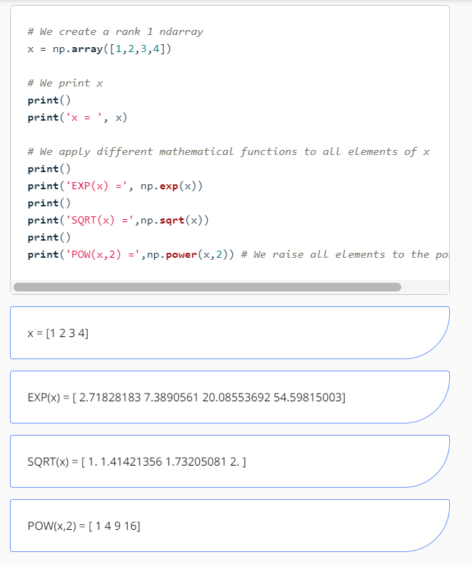

```Python
# We create a 2 x 2 ndarray
X = np.array([[1,2], [3,4]])

# We print x
print()
print('X = \n', X)
print()

print('Average of all elements in X:', X.mean())
print('Average of all elements in the columns of X:', X.mean(axis=0))
print('Average of all elements in the rows of X:', X.mean(axis=1))
print()
print('Sum of all elements in X:', X.sum())
print('Sum of all elements in the columns of X:', X.sum(axis=0))
print('Sum of all elements in the rows of X:', X.sum(axis=1))
print()
print('Standard Deviation of all elements in X:', X.std())
print('Standard Deviation of all elements in the columns of X:', X.std(axis=0))
print('Standard Deviation of all elements in the rows of X:', X.std(axis=1))
print()
print('Median of all elements in X:', np.median(X))
print('Median of all elements in the columns of X:', np.median(X,axis=0))
print('Median of all elements in the rows of X:', np.median(X,axis=1))
print()
print('Maximum value of all elements in X:', X.max())
print('Maximum value of all elements in the columns of X:', X.max(axis=0))
print('Maximum value of all elements in the rows of X:', X.max(axis=1))
print()
print('Minimum value of all elements in X:', X.min())
print('Minimum value of all elements in the columns of X:', X.min(axis=0))
print('Minimum value of all elements in the rows of X:', X.min(axis=1))
```


## Pandas


Example 1 - Create a Series
```Python
# We import Pandas as pd into Python
import pandas as pd

# We create a Pandas Series that stores a grocery list
groceries = pd.Series(data = [30, 6, 'Yes', 'No'], index = ['eggs', 'apples', 'milk', 'bread'])

# We display the Groceries Pandas Series
groceries
```


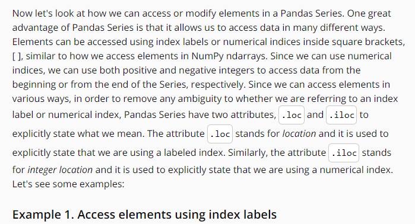
```Python
# We access elements in Groceries using index labels:

# We use a single index label
print('How many eggs do we need to buy:', groceries['eggs'])
print()

# we can access multiple index labels
print('Do we need milk and bread:\n', groceries[['milk', 'bread']]) 
print()

# we use loc to access multiple index labels
print('How many eggs and apples do we need to buy:\n', groceries.loc[['eggs', 'apples']]) 
print()

# We access elements in Groceries using numerical indices:

# we use multiple numerical indices
print('How many eggs and apples do we need to buy:\n',  groceries[[0, 1]]) 
print()

# We use a negative numerical index
print('Do we need bread:\n', groceries[[-1]]) 
print()

# We use a single numerical index
print('How many eggs do we need to buy:', groceries[0]) 
print()
# we use iloc to access multiple numerical indices
print('Do we need milk and bread:\n', groceries.iloc[[2, 3]]) 
```
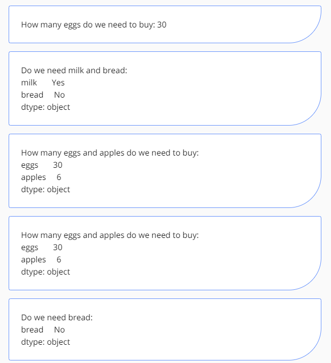


```Python
# We display the original grocery list
print('Original Grocery List:\n', groceries)

# We remove apples from our grocery list. The drop function removes elements out of place
print()
print('We remove apples (out of place):\n', groceries.drop('apples'))

# When we remove elements out of place the original Series remains intact. To see this
# we display our grocery list again
print()
print('Grocery List after removing apples out of place:\n', groceries)
```
```Python

# We display the original grocery list
print('Original Grocery List:\n', groceries)

# We remove apples from our grocery list in place by setting the inplace keyword to True
groceries.drop('apples', inplace = True)

# When we remove elements in place the original Series its modified. To see this
# we display our grocery list again
print()
print('Grocery List after removing apples in place:\n', groceries)
```
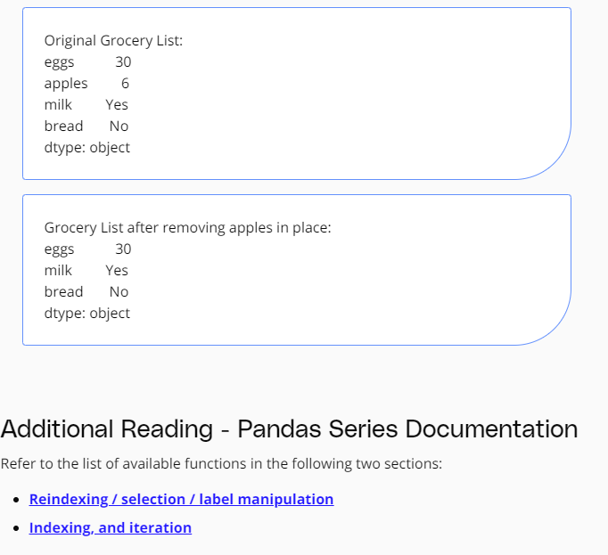

```Python
# We create a Pandas Series that stores a grocery list of just fruits
fruits= pd.Series(data = [10, 6, 3,], index = ['apples', 'oranges', 'bananas'])

# We display the fruits Pandas Series
fruits
```

```Python
# We print fruits for reference
print('Original grocery list of fruits:\n ', fruits)

# We perform basic element-wise operations using arithmetic symbols
print()
print('fruits + 2:\n', fruits + 2) # We add 2 to each item in fruits
print()
print('fruits - 2:\n', fruits - 2) # We subtract 2 to each item in fruits
print()
print('fruits  *2:\n', fruits*  2) # We multiply each item in fruits by 2 
print()
print('fruits / 2:\n', fruits / 2) # We divide each item in fruits by 2
print()
```


```Python
# We import NumPy as np to be able to use the mathematical functions
import numpy as np

# We print fruits for reference
print('Original grocery list of fruits:\n', fruits)

# We apply different mathematical functions to all elements of fruits
print()
print('EXP(X) = \n', np.exp(fruits))
print() 
print('SQRT(X) =\n', np.sqrt(fruits))
print()
print('POW(X,2) =\n',np.power(fruits,2)) # We raise all elements of fruits to the power of 2
```


```Python
# We print fruits for reference
print('Original grocery list of fruits:\n ', fruits)
print()

# We add 2 only to the bananas
print('Amount of bananas + 2 = ', fruits['bananas'] + 2)
print()

# We subtract 2 from apples
print('Amount of apples - 2 = ', fruits.iloc[0] - 2)
print()

# We multiply apples and oranges by 2
print('We double the amount of apples and oranges:\n', fruits[['apples', 'oranges']] * 2)
print()

# We divide apples and oranges by 2
print('We half the amount of apples and oranges:\n', fruits.loc[['apples', 'oranges']] / 2)
```


```Python
# We import Pandas as pd into Python
import pandas as pd

# We create a dictionary of Pandas Series 
items = {'Bob' : pd.Series(data = [245, 25, 55], index = ['bike', 'pants', 'watch']),
         'Alice' : pd.Series(data = [40, 110, 500, 45], index = ['book', 'glasses', 'bike', 'pants'])}

# We print the type of items to see that it is a dictionary
print(type(items))
```

```Python
# We create a Pandas DataFrame by passing it a dictionary of Pandas Series
shopping_carts = pd.DataFrame(items)

# We display the DataFrame
shopping_carts
```


Example 3. Demonstrate a few attributes of DataFrame
```Python
# We print some information about shopping_carts
print('shopping_carts has shape:', shopping_carts.shape)
print('shopping_carts has dimension:', shopping_carts.ndim)
print('shopping_carts has a total of:', shopping_carts.size, 'elements')
print()
print('The data in shopping_carts is:\n', shopping_carts.values)
print()
print('The row index in shopping_carts is:', shopping_carts.index)
print()
print('The column index in shopping_carts is:', shopping_carts.columns)
```


```Python
# We Create a DataFrame that only has selected items for both Alice and Bob
sel_shopping_cart = pd.DataFrame(items, index = ['pants', 'book'])

# We display sel_shopping_cart
sel_shopping_cart
```

Example 5. Selecting specific columns of a DataFrame
```Python
# We Create a DataFrame that only has selected items for Alice
alice_sel_shopping_cart = pd.DataFrame(items, index = ['glasses', 'bike'], columns = ['Alice'])

# We display alice_sel_shopping_cart
alice_sel_shopping_cart
```


```Python
# We print the store_items DataFrame
print(store_items)

# We access rows, columns and elements using labels
print()
print('How many bikes are in each store:\n', store_items[['bikes']])
print()
print('How many bikes and pants are in each store:\n', store_items[['bikes', 'pants']])
print()
print('What items are in Store 1:\n', store_items.loc[['store 1']])
print()
print('How many bikes are in Store 2:', store_items['bikes']['store 2'])
```


```Python
# We add a new column named shirts to our store_items DataFrame indicating the number of
# shirts in stock at each store. We will put 15 shirts in store 1 and 2 shirts in store 2
store_items['shirts'] = [15,2]

# We display the modified DataFrame
store_items
```

```Python
# We make a new column called suits by adding the number of shirts and pants
store_items['suits'] = store_items['pants'] + store_items['shirts']

# We display the modified DataFrame
store_items
```

```Python
# We create a dictionary from a list of Python dictionaries that will contain the number of different items at the new store
new_items = [{'bikes': 20, 'pants': 30, 'watches': 35, 'glasses': 4}]

# We create new DataFrame with the new_items and provide and index labeled store 3
new_store = pd.DataFrame(new_items, index = ['store 3'])

# We display the items at the new store
new_store
```

Example 5. Add new column that has data from the existing columns
```Python
# We add a new column using data from particular rows in the watches column
store_items['new watches'] = store_items['watches'][1:]

# We display the modified DataFrame
store_items
```

Example 6. Add new column at a specific location
```Python
# We insert a new column with label shoes right before the column with numerical index 4
store_items.insert(4, 'shoes', [8,5,0])

# we display the modified DataFrame
store_items
```


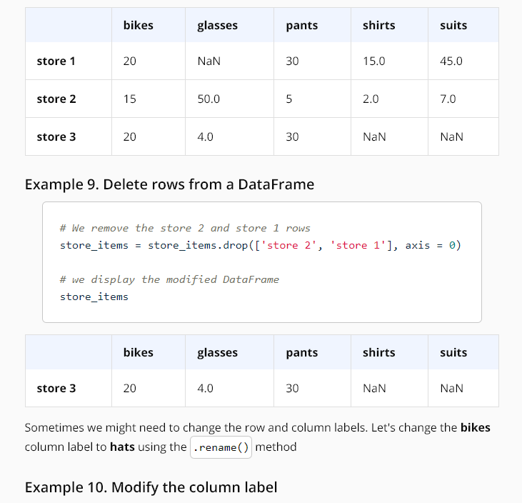


```Python
# We create a list of Python dictionaries
items2 = [{'bikes': 20, 'pants': 30, 'watches': 35, 'shirts': 15, 'shoes':8, 'suits':45},
{'watches': 10, 'glasses': 50, 'bikes': 15, 'pants':5, 'shirts': 2, 'shoes':5, 'suits':7},
{'bikes': 20, 'pants': 30, 'watches': 35, 'glasses': 4, 'shoes':10}]

# We create a DataFrame  and provide the row index
store_items = pd.DataFrame(items2, index = ['store 1', 'store 2', 'store 3'])

# We display the DataFrame
store_items
```


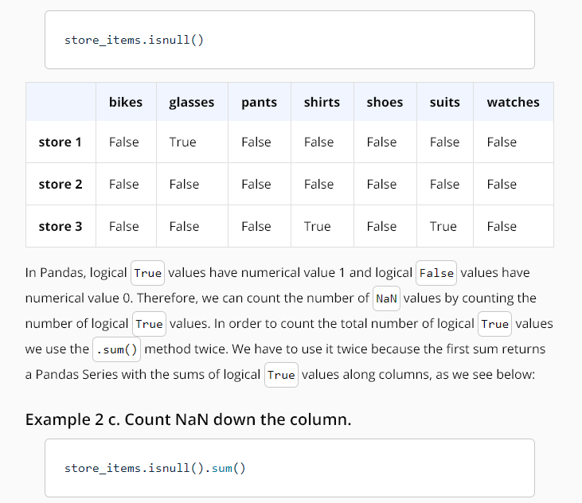

```Python
# We print the number of non-NaN values in our DataFrame
print()
print('Number of non-NaN values in the columns of our DataFrame:\n', store_items.count())
```


```Python
# We replace NaN values by using linear interpolation using column values
store_items.interpolate(method = 'linear', axis = 0)
```

```Python
# We replace NaN values by using linear interpolation using row values
store_items.interpolate(method = 'linear', axis = 1)
```


```Python
# We display the total salary each employee received in all the years they worked for the company
data.groupby(['Name'])['Salary'].sum()
```


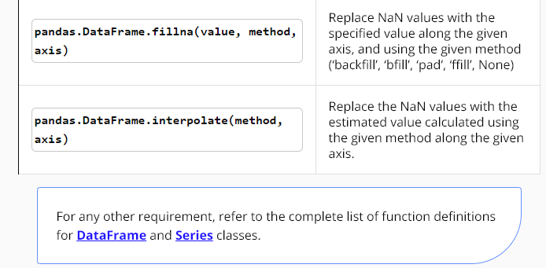


Quiz Solution: Implement my_enumerate
```Python
lessons = ["Why Python Programming", "Data Types and Operators", "Control Flow", "Functions", "Scripting"]

def my_enumerate(iterable, start=0):
    count = start
    for element in iterable:
        yield count, element
        count += 1

for i, lesson in my_enumerate(lessons, 1):
    print("Lesson {}: {}".format(i, lesson))
```


```Python
sq_list = [x**2 for x in range(10)]  # this produces a list of squares

sq_iterator = (x**2 for x in range(10))  # this produces an iterator of squares
```
This can help you save time and create efficient code!
