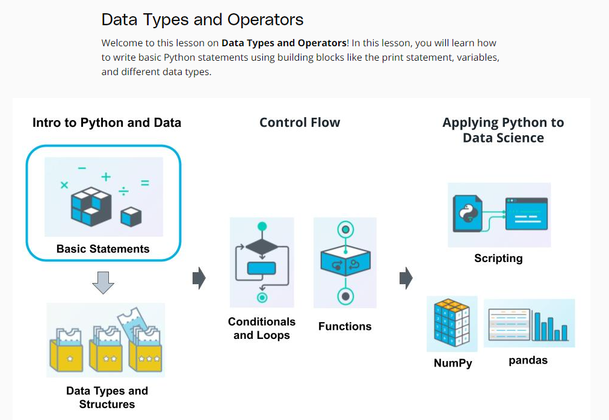
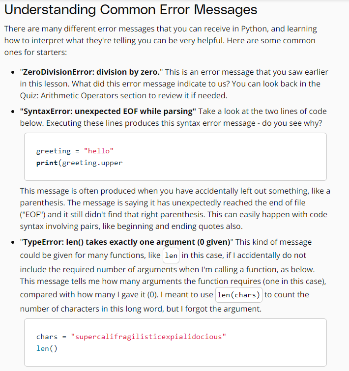

# Python
---
## Overview



## Data types and operators


Although the **last** two of these would **work** in Python, they are not pythonic ways to name variables.


```Python
verse = "If you can keep your head when all about you\n  Are losing theirs and blaming it on you,\nIf you can trust yourself when all men doubt you,\n  But make allowance for their doubting too;\nIf you can wait and not be tired by waiting,\n  Or being lied about, don’t deal in lies,\nOr being hated, don’t give way to hating,\n  And yet don’t look too good, nor talk too wise:"
print(verse, "\n")

print("Verse has a length of {} characters.".format(len(verse)))
print("The first occurence of the word 'and' occurs at the {}th index.".format(verse.find('and')))
print("The last occurence of the word 'you' occurs at the {}th index.".format(verse.rfind('you')))
print("The word 'you' occurs {} times in the verse.".format(verse.count('you')))
```
Here's another way you could write the print statements and get the same output. Recall that a string is an ordered datatype, and therefore, each item can be called by a location, and a location is each character.
```Python
verse = "If you can keep your head when all about you\n  Are losing theirs and blaming it on you,\nIf you can trust yourself when all men doubt you,\n  But make allowance for their doubting too;\nIf you can wait and not be tired by waiting,\n  Or being lied about, don’t deal in lies,\nOr being hated, don’t give way to hating,\n  And yet don’t look too good, nor talk too wise:"
print(verse, "\n")

message = "Verse has a length of {} characters.\nThe first occurence of the \
word 'and' occurs at the {}th index.\nThe last occurence of the word 'you' \
occurs at the {}th index.\nThe word 'you' occurs {} times in the verse."

length = len(verse)
first_idx = verse.find('and')
last_idx = verse.rfind('you')
count = verse.count('you')

print(message.format(length, first_idx, last_idx, count))
```





## Data structures in python