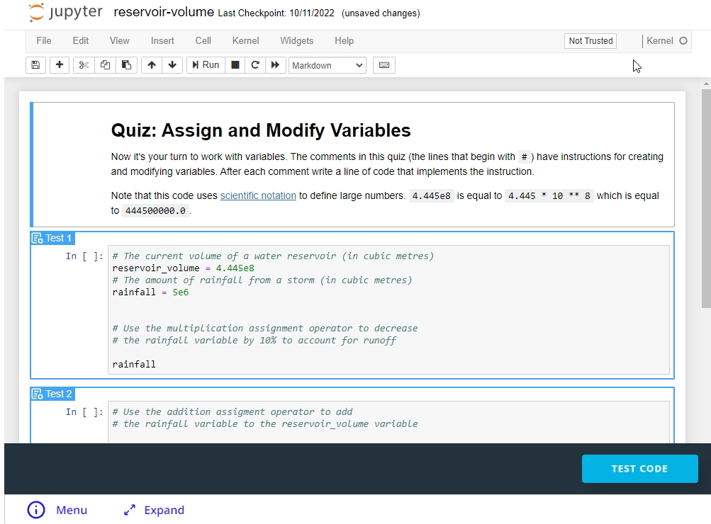
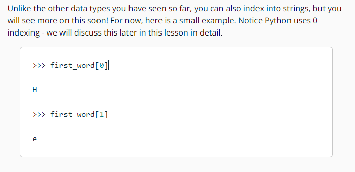
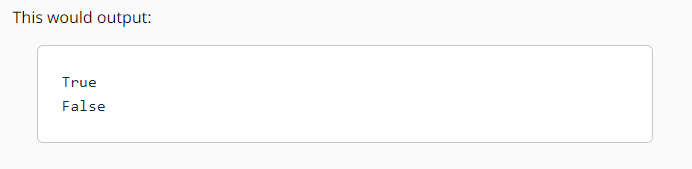
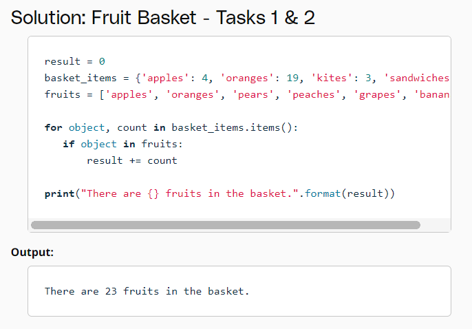
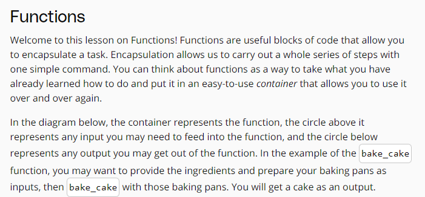
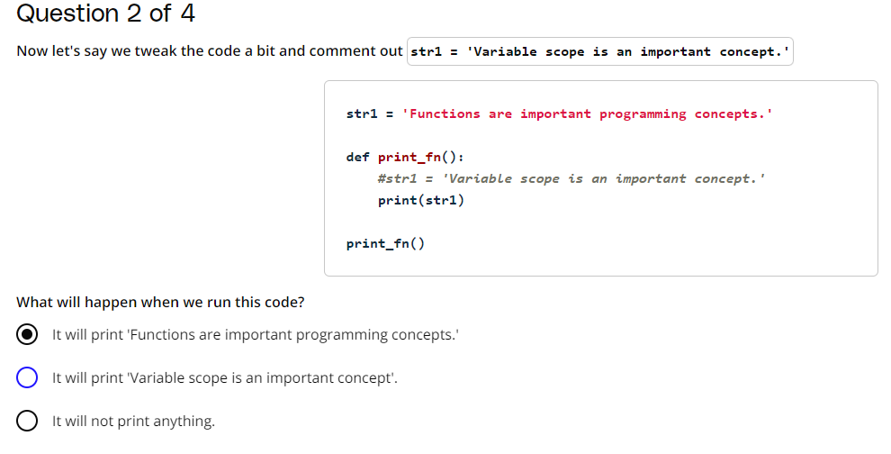
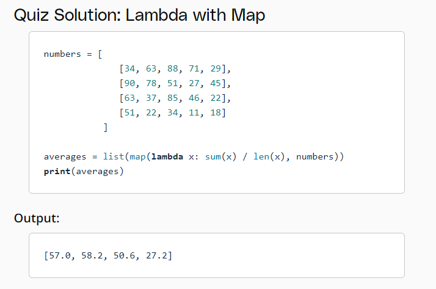
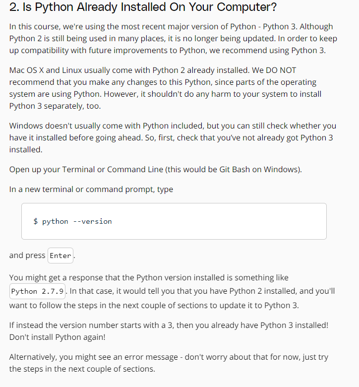

# Python
---
## Overview





## Data types and operators


Although the **last** two of these would **work** in Python, they are not pythonic ways to name variables.





```Python
verse = "If you can keep your head when all about you\n  Are losing theirs and blaming it on you,\nIf you can trust yourself when all men doubt you,\n  But make allowance for their doubting too;\nIf you can wait and not be tired by waiting,\n  Or being lied about, don’t deal in lies,\nOr being hated, don’t give way to hating,\n  And yet don’t look too good, nor talk too wise:"
print(verse, "\n")

print("Verse has a length of {} characters.".format(len(verse)))
print("The first occurence of the word 'and' occurs at the {}th index.".format(verse.find('and')))
print("The last occurence of the word 'you' occurs at the {}th index.".format(verse.rfind('you')))
print("The word 'you' occurs {} times in the verse.".format(verse.count('you')))
```
Here's another way you could write the print statements and get the same output. Recall that a string is an ordered datatype, and therefore, each item can be called by a location, and a location is each character.
```Python
verse = "If you can keep your head when all about you\n  Are losing theirs and blaming it on you,\nIf you can trust yourself when all men doubt you,\n  But make allowance for their doubting too;\nIf you can wait and not be tired by waiting,\n  Or being lied about, don’t deal in lies,\nOr being hated, don’t give way to hating,\n  And yet don’t look too good, nor talk too wise:"
print(verse, "\n")

message = "Verse has a length of {} characters.\nThe first occurence of the \
word 'and' occurs at the {}th index.\nThe last occurence of the word 'you' \
occurs at the {}th index.\nThe word 'you' occurs {} times in the verse."

length = len(verse)
first_idx = verse.find('and')
last_idx = verse.rfind('you')
count = verse.count('you')

print(message.format(length, first_idx, last_idx, count))
```


## Data structures in python





**Solution: Count Unique Words**
```Python
verse = "if you can keep your head when all about you are losing theirs and blaming it on you   if you can trust yourself when all men doubt you     but make allowance for their doubting too   if you can wait and not be tired by waiting      or being lied about  don’t deal in lies   or being hated  don’t give way to hating      and yet don’t look too good  nor talk too wise"
print(verse, "\n")

## split verse into list of words
verse_list = verse.split()
print(verse_list, '\n')

## convert list to set to get unique words
verse_set = set(verse_list)
print(verse_set, '\n')

## print the number of unique words
num_unique = len(verse_set)
print(num_unique)
```
Output
```Python
if you can keep your head when all about you are losing theirs and blaming it on you   if you can trust yourself when all men doubt you     but make allowance for their doubting too   if you can wait and not be tired by waiting      or being lied about  don’t deal in lies   or being hated  don’t give way to hating      and yet don’t look too good  nor talk too wise 

['if', 'you', 'can', 'keep', 'your', 'head', 'when', 'all', 'about', 'you', 'are', 'losing', 'theirs', 'and', 'blaming', 'it', 'on', 'you', 'if', 'you', 'can', 'trust', 'yourself', 'when', 'all', 'men', 'doubt', 'you', 'but', 'make', 'allowance', 'for', 'their', 'doubting', 'too', 'if', 'you', 'can', 'wait', 'and', 'not', 'be', 'tired', 'by', 'waiting', 'or', 'being', 'lied', 'about', 'don’t', 'deal', 'in', 'lies', 'or', 'being', 'hated', 'don’t', 'give', 'way', 'to', 'hating', 'and', 'yet', 'don’t', 'look', 'too', 'good', 'nor', 'talk', 'too', 'wise'] 

{'or', 'when', 'hating', 'make', 'all', 'head', 'waiting', 'losing', 'don’t', 'to', 'look', 'about', 'yourself', 'by', 'wise', 'doubting', 'trust', 'deal', 'allowance', 'being', 'too', 'wait', 'in', 'nor', 'for', 'theirs', 'and', 'if', 'on', 'lied', 'are', 'your', 'but', 'give', 'yet', 'lies', 'good', 'men', 'tired', 'doubt', 'hated', 'blaming', 'can', 'be', 'keep', 'their', 'not', 'it', 'talk', 'way', 'you'} 

51
```
**Solution: Verse Dictionary**
```Python
verse_dict =  {'if': 3, 'you': 6, 'can': 3, 'keep': 1, 'your': 1, 'head': 1, 'when': 2, 'all': 2, 'about': 2, 'are': 1, 'losing': 1, 'theirs': 1, 'and': 3, 'blaming': 1, 'it': 1, 'on': 1, 'trust': 1, 'yourself': 1, 'men': 1, 'doubt': 1, 'but': 1, 'make': 1, 'allowance': 1, 'for': 1, 'their': 1, 'doubting': 1, 'too': 3, 'wait': 1, 'not': 1, 'be': 1, 'tired': 1, 'by': 1, 'waiting': 1, 'or': 2, 'being': 2, 'lied': 1, 'don\'t': 3, 'deal': 1, 'in': 1, 'lies': 1, 'hated': 1, 'give': 1, 'way': 1, 'to': 1, 'hating': 1, 'yet': 1, 'look': 1, 'good': 1, 'nor': 1, 'talk': 1, 'wise': 1}
print(verse_dict, '\n')

## find number of unique keys in the dictionary
num_keys = len(verse_dict)
print(num_keys)

## find whether 'breathe' is a key in the dictionary
contains_breathe = "breathe" in verse_dict
print(contains_breathe)

## create and sort a list of the dictionary's keys
items = list(verse_dict.items())
def sort_by_value(item):
    return item[1]
items.sort(key=sort_by_value)
sorted_keys = [item[0] for item in items]

## An alternative solution is to use a lambda function
sorted_keys = [k for k, v in sorted(verse_dict.items(), key=lambda item: item[1])]

## get the first element in the sorted list of keys
print(sorted_keys[0])

## find the element with the highest value in the list of keys
print(sorted_keys[-1]) 
```
Output
```Python
{'make': 1, 'waiting': 1, 'tired': 1, 'when': 2, 'hating': 1, 'give': 1, 'talk': 1, 'losing': 1, 'look': 1, 'too': 3, 'doubting': 1, 'all': 2, 'be': 1, 'wait': 1, 'you': 6, 'it': 1, 'allowance': 1, 'being': 2, 'by': 1, 'for': 1, 'to': 1, 'men': 1, 'in': 1, 'can': 3, 'about': 2, 'are': 1, 'hated': 1, 'wise': 1, 'your': 1, 'yourself': 1, "don't": 3, 'good': 1, 'way': 1, 'keep': 1, 'if': 3, 'blaming': 1, 'nor': 1, 'but': 1, 'or': 2, 'on': 1, 'not': 1, 'deal': 1, 'trust': 1, 'doubt': 1, 'yet': 1, 'lied': 1, 'lies': 1, 'their': 1, 'theirs': 1, 'and': 3, 'head': 1} 

51
False
keep
you
```


## Control flow





```Python
#ALTERNATIVE SECOND PART OF SOLUTION
highest_count = max(win_count_dict.values())

most_win_director = [key for key, value in win_count_dict.items() if value == highest_count]
```

## Functions



```Python
def population_density(population, land_area):
    return population/land_area

# test cases for your function
test1 = population_density(10, 1)
expected_result1 = 10
print("expected result: {}, actual result: {}".format(expected_result1, test1))

test2 = population_density(864816, 121.4)
expected_result2 = 7123.6902801
print("expected result: {}, actual result: {}".format(expected_result2, test2))
```

```Python
def readable_timedelta(days):
    # use integer division to get the number of weeks
    weeks = days // 7
    # use % to get the number of days that remain
    remainder = days % 7
    return "{} week(s) and {} day(s).".format(weeks, remainder)

# test your function
print(readable_timedelta(10))
```


```Python
def some_function():
    print(word)

some_function()```
Notice that we can still access the value of the global variable `word` within this function. However, the value of a global variable can not be __modified__ inside the function. If you want to modify that variable's value inside this function, it should be passed in as an argument. You'll see more on this in the next quiz.

Scope is essential to understanding how information is passed throughout programs in Python and really any programming language.
```





```Python
def readable_timedelta(days):
    """Return a string of the number of weeks and days included in days."""
    weeks = days // 7
    remainder = days % 7
    return "{} week(s) and {} day(s)".format(weeks, remainder)
def readable_timedelta(days):
    """Return a string of the number of weeks and days included in days.

    Args:
        days (int): number of days to convert
    """
    weeks = days // 7
    remainder = days % 7
    return "{} week(s) and {} day(s)".format(weeks, remainder)
def readable_timedelta(days):
    """
    Return a string of the number of weeks and days included in days.

    Parameters:
    days -- number of days to convert (int)

    Returns:
    string of the number of weeks and days included in days
    """
    weeks = days // 7
    remainder = days % 7
    return "{} week(s) and {} day(s)".format(weeks, remainder)
```





## Scripting





