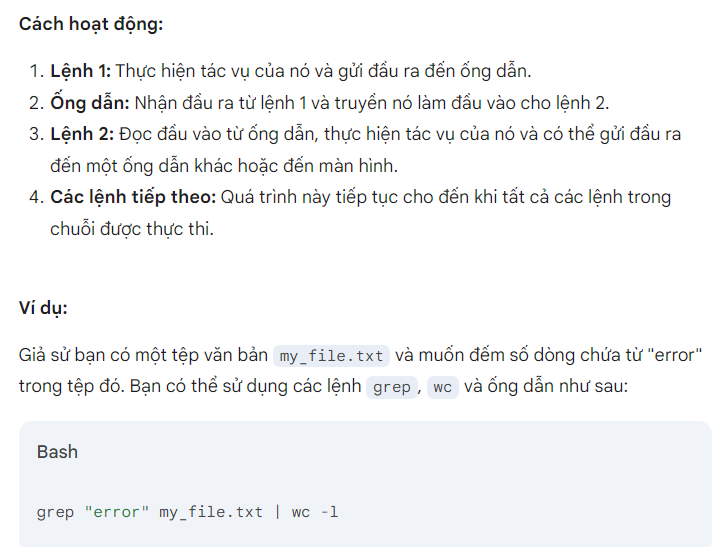
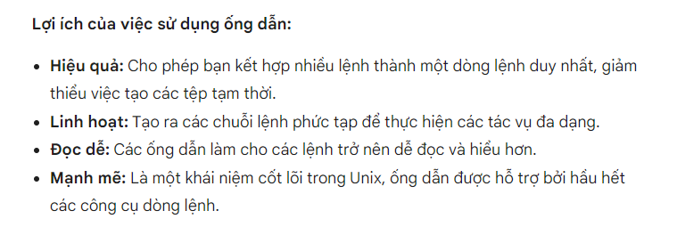
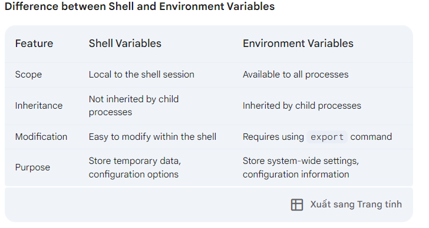

# Shell
---
## Tại sao lại gọi là shell
"**Shell**" trong ngữ cảnh này dịch sang tiếng Việt có nghĩa là "vỏ". Vậy tại sao một giao diện để tương tác với hệ điều hành lại được ví như một cái vỏ?

Để hiểu rõ hơn, hãy hình dung hệ điều hành như một quả táo. **Kernel** (nhân) là phần cứng bên trong, chịu trách nhiệm thực hiện các tác vụ cốt lõi. **Shell** chính là lớp vỏ bên ngoài, là giao diện mà người dùng trực tiếp tương tác với hệ điều hành.

**Vì sao gọi là "vỏ"?**

+ Lớp bao bọc: Shell đóng vai trò như một lớp vỏ bảo vệ bên ngoài, che chắn người dùng khỏi các chi tiết phức tạp bên trong kernel.
+ Giao tiếp: Shell là cầu nối giữa người dùng và kernel. Khi bạn nhập một lệnh vào shell, nó sẽ dịch lệnh đó thành các tín hiệu mà kernel hiểu được, sau đó kernel sẽ thực hiện lệnh và trả về kết quả.
+ Tùy biến: Giống như bạn có thể thay đổi vỏ của một chiếc điện thoại, shell cũng có thể được tùy chỉnh để phù hợp với nhu cầu và sở thích của người dùng. Có nhiều loại shell khác nhau với các tính năng và giao diện khác nhau.

**Ví dụ:**

+ **Bash**: Đây là một trong những shell phổ biến nhất, được sử dụng rộng rãi trong các hệ thống **Unix-like**.
+ **Zsh**: Một shell mạnh mẽ với nhiều tính năng hiện đại, thường được sử dụng bởi các lập trình viên.
+ **Fish**: Một shell được thiết kế với giao diện thân thiện với người dùng, có khả năng tự hoàn thành lệnh và gợi ý thông minh.

**Tóm lại**

Việc gọi giao diện lệnh là "shell" giúp chúng ta hình dung rõ hơn về vai trò của nó trong hệ điều hành. Shell là một công cụ mạnh mẽ, cho phép người dùng **tương tác trực tiếp với hệ thống và thực hiện các tác vụ một cách hiệu quả.**

Bạn có muốn tìm hiểu thêm về các loại shell hoặc cách sử dụng shell không?

Một số khái niệm liên quan bạn có thể quan tâm:

+ **Terminal**: Đây là cửa sổ hoặc ứng dụng mà bạn sử dụng để tương tác với shell.
+ **Command-line interface (CLI)**: Giao diện dòng lệnh, là cách giao tiếp với máy tính bằng cách nhập các lệnh văn bản.
+ **Shell script**: Một tập hợp các lệnh shell được viết trong một file, giúp tự động hóa các tác vụ lặp đi lặp lại.

## Unix là gì?

***AI của udacity trả lời:***

Unix is a powerful, multiuser, multitasking operating system originally developed in the 1960s and 1970s at Bell Labs. It has become the foundation for many modern operating systems, including Linux and macOS. Here are some key features and concepts related to Unix:

1. **Multiuser**: Unix allows multiple users to access the system simultaneously. Each user can have their own environment and files, which makes it ideal for servers and collaborative environments.

2. **Multitasking**: Unix can run multiple processes at the same time. This means you can execute several programs concurrently, which is essential for efficient resource management.

3. **Command-Line Interface**: Unix primarily uses a command-line interface (CLI) for user interaction. Users type commands to perform tasks, which can be more efficient than using a graphical user interface (GUI).

4. **File System**: Unix has a hierarchical file system structure, where everything is treated as a file, including devices and processes. This makes it easier to manage and organize data.

5. **Portability**: Unix was designed to be portable, meaning it can run on various hardware platforms. This has contributed to its widespread adoption and the development of Unix-like systems.

6. **Networking**: Unix has strong networking capabilities, making it suitable for server environments and remote administration.

7. **Shell**: The shell in Unix is a command-line interpreter that allows users to interact with the operating system. There are various shells available, with Bash (Bourne Again SHell) being one of the most popular.

Unix has influenced many operating systems and remains a significant part of the computing landscape today. Do you have any specific questions about Unix or how it relates to your studies in the Shell Workshop? I'm here to help!

***Bard trả lời:***

Unix là một hệ điều hành máy tính đa nhiệm, đa người dùng được phát triển vào những năm 1960 và 1970 tại Bell Labs. Nó được xem là một trong những hệ điều hành quan trọng nhất trong lịch sử công nghệ thông tin, đặt nền móng cho nhiều hệ điều hành hiện đại khác.

Đặc điểm chính của Unix:

+ Đa nhiệm, đa người dùng: Unix cho phép nhiều người dùng cùng làm việc trên hệ thống một cách đồng thời, thực hiện nhiều tác vụ khác nhau.
+ Cấu trúc dạng cây: Hệ thống tệp của Unix được tổ chức theo cấu trúc dạng cây, giúp quản lý tệp và thư mục một cách hiệu quả.
+ Giao diện dòng lệnh: Unix sử dụng giao diện dòng lệnh (command-line interface) để người dùng tương tác với hệ thống, cung cấp độ linh hoạt cao.
Khả năng mở rộng: Unix có thể được tùy chỉnh và mở rộng để đáp ứng các nhu cầu khác nhau.
+ Độ ổn định cao: Unix nổi tiếng với độ ổn định và bảo mật, thường được sử dụng trong các hệ thống máy chủ quan trọng.

**Tại sao Unix lại quan trọng?**

+ Nền tảng cho nhiều hệ điều hành khác: Unix là "cha đẻ" của nhiều hệ điều hành phổ biến hiện nay, như Linux, macOS, và các hệ điều hành di động.
+ Phát triển phần mềm: Unix được sử dụng rộng rãi trong phát triển phần mềm, cung cấp một môi trường làm việc mạnh mẽ và linh hoạt.
+ Hệ thống máy chủ: Unix được sử dụng trong các hệ thống máy chủ lớn để cung cấp dịch vụ cho hàng triệu người dùng.
+ Môi trường học tập: Unix là một công cụ học tập tuyệt vời để hiểu sâu về hệ điều hành và lập trình.

**Các biến thể phổ biến của Unix:**

+ Linux: Một hệ điều hành mã nguồn mở dựa trên Unix, được sử dụng rộng rãi trên máy tính cá nhân, máy chủ, và các thiết bị nhúng.
+ macOS: Hệ điều hành của Apple, được phát triển dựa trên BSD Unix, sử dụng trên các máy Mac.
+ Solaris: Một hệ điều hành Unix được phát triển bởi Oracle, chủ yếu được sử dụng trong các hệ thống máy chủ lớn.

**Tóm lại,** Unix là một hệ điều hành có ảnh hưởng sâu rộng đến ngành công nghệ thông tin. Nó đã tạo ra một nền tảng vững chắc cho sự phát triển của các hệ điều hành hiện đại và tiếp tục được sử dụng rộng rãi trong nhiều lĩnh vực khác nhau.

## Lý do dùng shell?
- Hệ thống Linux được sử dụng rộng rãi, nhiều Linux server trên thực tế
- Nhanh hơn GUI, tương tác trực tiếp với hệ thống
- Nhìn chuyên nghiệp hơn, đúng nghĩa lập trình
- Làm nhiều sẽ nhớ câu lệnh hehe
- Đưa input vào và nhận lại output nhanh chóng
- Trên mac, linux gọi là termial
- Window thì có **command prompt** lưu ý đây không được gọi là shell, nó dựa trên MS-DOS command line hơn là Unix
- Bash shell là shell được sử dụng phổ biến nhất

## Intro to the Shell

## Echo
- Dấu chấm than '!' hay nhiều kí tự khác có ý nghĩa đặc biệt với shell nên cần tránh bằng sử dụng dấu nháy đơn, như trong ví dụ dưới đây nếu không có nháy đơn sẽ bị echo nhiều lần rất ngớ ngẩn

- Shell có nhiều biến đặc biệt, để nhận biết biến ta sử dụng dấu dollar $

## Navigating directories (ls, cd, ..)

DOT DOT .. gọi là parent directory

## Current working directory (pwd)

## Parameters and options (ls -l) long

## Organizing your files (mkdir, mv)

## Downloading (curl)

Lý do cần -L vì nếu không follow redirect thì thu được rất ít thông tin, không đúng URL cuối cùng

## Viewing files (cat, less)

Cat thì show toàn bộ file
Less thì show một ít, muốn xem tiếp thì ấn Enter hoặc sử dụng mũi tên xuống
Một số tùy chọn khác với với Less như B -> go back, / -> tìm kiếm, Q -> thoát xem file

## Removing things (rm, rmdir)

Không giống như GUI, xóa xong thì còn có thể phục hồi bằng cách tìm ở thùng rác recycle bin, dùng CLI thì xóa ngay lập tức, để tạo lời nhắc thì sử dụng option -i nghĩa là iterate, tức hỏi lại xem có thực sự muốn xóa hay không

## Searching and pipes (grep, wc)

grep -> cmd
shell -> từ muốn tìm
directory.txt -> file mục tiêu
| less -> option để không hiển thị hết, muốn hiển thị thêm thì ấn Enter hoặc sử dụng mũi tên xuống
| gọi là pipe

tùy chọn với wc

Trên terminal, log tiến trình của curl có thể lẫn với grep nhưng việc tìm kết quả sẽ không tìm ở log tiến trình curl mà chỉ tìm ở kết quả curl trả về

## Shell and environment variables

windows thì LOGNAME thay bằng whoami

## Startup files (.bash_profile)
Shell không chỉ là user interface mà còn là 1 ngôn ngữ lập trình
-> sử dụng shell script

## Aliases

