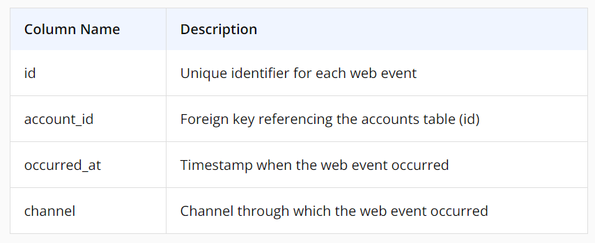
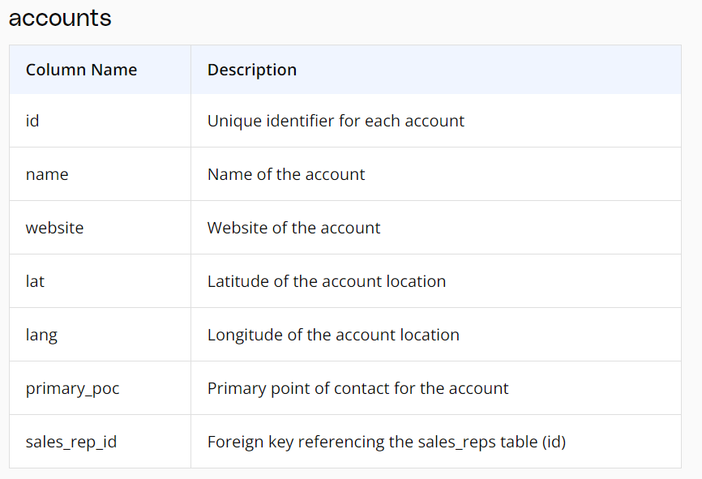
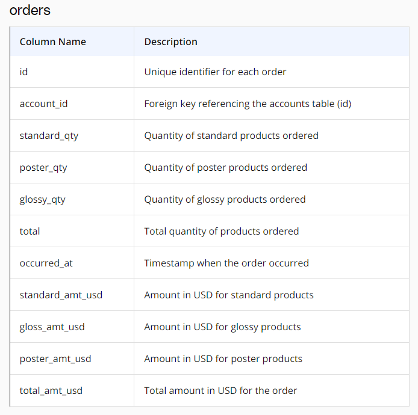
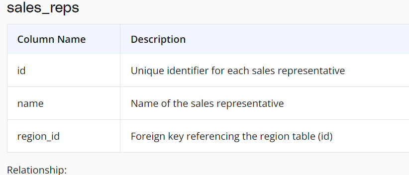
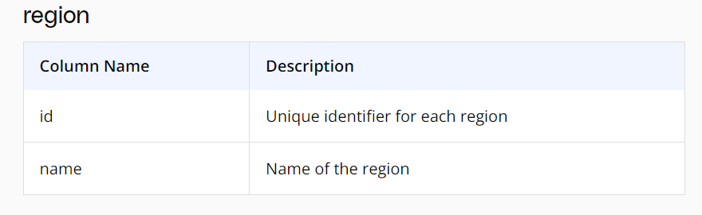
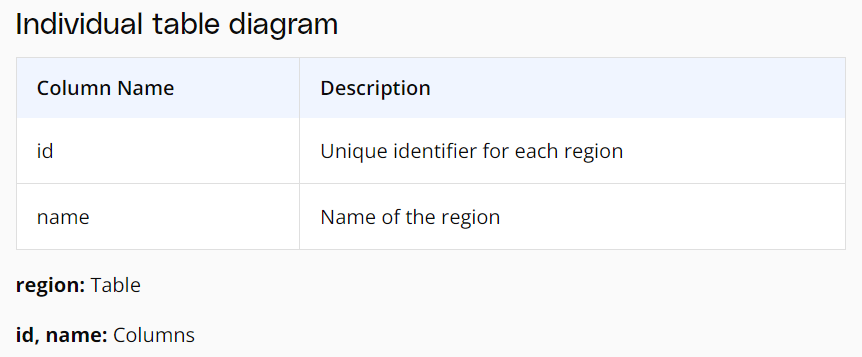
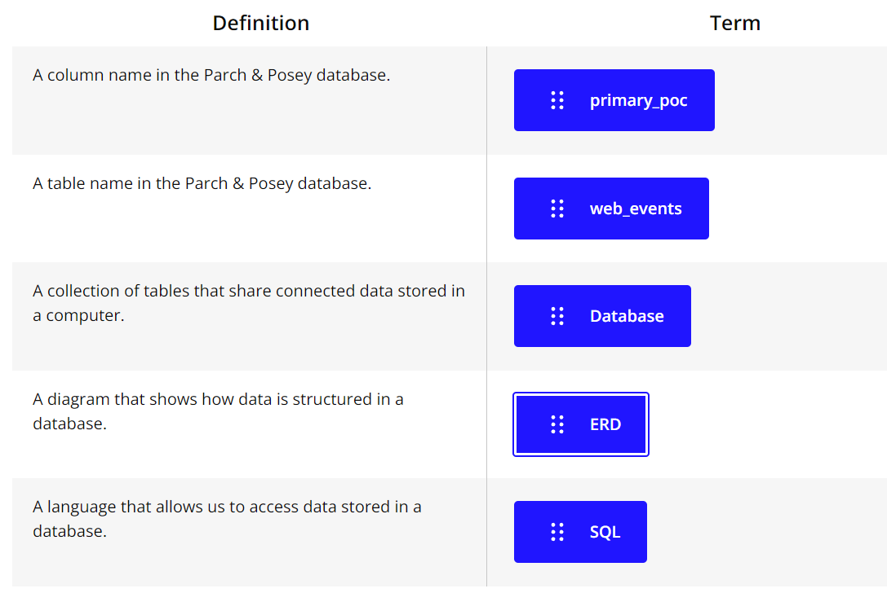

### Udacity
# Programming for data science nanodegree
---
## Looking ahead
Why we need programming for analysis?
2 điều quan trọng trong phân tích dữ liệu là thống kê và lập trình.
Lập trình quan trọng ntn?
Điều đầu tiên là programming cho phép bạn làm việc với các tập dữ liệu lớn/dataset hơn là làm việc với excel, gg sheet vô cùng thủ công.
Làm sao mà gg có thể xử lý hàng tỉ tỉ queries mỗi năm? Cũng như các nền tảng khác làm sao để xử lý lượng traffic khổng lồ từ khắp nơi trên thế giới?
Điều thứ 2 là programming cho phép tự động hóa các processes, điều mà trước đây phải được thực hiện một cách thủ công và tốn thời gian.

## Projects
Học phải đi đôi với hành! Learning by doing!
Project 1: Sử dụng SQL với cơ sở dữ liệu quan hệ về movie rentals.
Project 2: Sử dụng Python để phân tích bike share data được thu thập từ 3 cities.
Project 3: Build Github profile để share về các project khác.

## Projects and progress
Không nhất thiết phải xem hết các videos nhưng phải làm hết các projects.
Xong projects là xong khóa học, tuy nhiên xem videos để học kiến thức chứ không phải vô bổ.

## Integrity and mindset
Không lấy bài của người khác để nộp, tự mình làm thì sẽ học được nhiều hơn. Hãy tin vào khả năng của mình, mở rộng giới hạn của bản thân.

## Leaning strategies
1. Space your learning, học trải đều hàng ngày chứ đừng học dồn một lúc.
2. Write notes, don't type note, mục đích để có thời gian ngấm thông tin, não bộ và tay làm việc với nhau.
3. Recall, don't just read your notes, hãy cố nhớ chứ đừng đọc lại, giống việc cô giáo kiểm tra thuộc bài cũ.
4. Connect the concepts, những cái đã học liên quan tới nhau ntn, giống nhau ntn, khác nhau ntn, tại sao chúng lại như thế?
5. Mistakes are learning opportunities, thất bại là mẹ thành công, học từ thất bại.

## Basic SQL
### Lesson Overview
In this lesson, we will cover and you will be able to:

+ Describe why SQL is important
+ Explain how SQL data is stored and structured
+ Create SQL queries using proper syntax including
    + SELECT & FROM
    + LIMIT
    + ORDER BY
    + WHERE
    + Basic arithmetic operations
    + LIKE
    + IN
    + NOT
    + AND & BETWEEN & OR

There is a lot to cover so let's get started!

### The Parch & Posey Database
In this course, we will mostly be using the Parch & Posey database for our queries. Whenever we use a different database, we will let you know.

Parch & Posey (not a real company) is a paper company and the database includes sales data for their paper.

Using the sales data, you'll be able to put your SQL skills to work with data you would find in the real world.

### Entity relationship diagrams (ERD)
An entity-relationship diagram (ERD) is a common way to view data in a database. Below is the ERD for the database we will use from Parch & Posey. These diagrams help you visualize the data you are analyzing including:

1. The names of the tables.
2. The columns in each table.
3. The way the tables work together.

You can think of each of the boxes below as a spreadsheet.

**Parch & Posey Database ERD**
**web_events**

Relationship:

account_id in the web_events table is a foreign key linked to the id (primary key) in the accounts table.

Relationship:

sales_rep_id in the accounts table is a foreign key linked to the id (primary key) in the sales_reps table.

Relationship:

account_id in the orders table is a foreign key linked to the id (primary key) in the accounts table.

Relationship:

region_id in the sales_reps table is a foreign key linked to the id (primary key) in the region table.

**What to Notice**
In the Parch & Posey database there are five tables (essentially 5 spreadsheets):

1. web_events
2. accounts
3. orders
4. sales_reps
5. region

You can think of each of these tables as an individual spreadsheet. Then the columns in each spreadsheet are listed below the table name. For example, the region table has two columns: id and name. Alternatively, the web_events table has four columns.

The "crow's foot" that connects the tables together shows us how the columns in one table relate to the columns in another table. In this first lesson, you will be learning the basics of how to work with SQL to interact with a single table. In the next lesson, you will learn more about why these connections are so important for working with SQL and relational databases.

Quiz 1:

### Why SQL is Important
**Introduction**

Before we dive into writing Structured Query Language (SQL) queries, let's take a look at what makes SQL and the databases that utilize SQL so popular.

I think it is an important distinction to say that SQL is a language. Hence, the last word of SQL being language. SQL is used all over the place beyond the databases we will utilize in this class. With that being said, SQL is most popular for its interaction with databases. For this class, you can think of a database as a bunch of excel spreadsheets all sitting in one place. Not all databases are a bunch of excel spreadsheets sitting in one place, but it is a reasonable idea for this class.

**Why Do Data Analysts Use SQL?**