### Udacity
# Programming for data science nanodegree
---
## Looking ahead
Why we need programming for analysis?
2 điều quan trọng trong phân tích dữ liệu là thống kê và lập trình.
Lập trình quan trọng ntn?
Điều đầu tiên là programming cho phép bạn làm việc với các tập dữ liệu lớn/dataset hơn là làm việc với excel, gg sheet vô cùng thủ công.
Làm sao mà gg có thể xử lý hàng tỉ tỉ queries mỗi năm? Cũng như các nền tảng khác làm sao để xử lý lượng traffic khổng lồ từ khắp nơi trên thế giới?
Điều thứ 2 là programming cho phép tự động hóa các processes, điều mà trước đây phải được thực hiện một cách thủ công và tốn thời gian.

## Projects
Học phải đi đôi với hành! Learning by doing!
Project 1: Sử dụng SQL với cơ sở dữ liệu quan hệ về online DVD rentals.
Project 2: Sử dụng Python để phân tích bike share data được thu thập từ 3 cities.
Project 3: Build Github profile để share về các project khác.

## Projects and progress
Không nhất thiết phải xem hết các videos nhưng phải làm hết các projects.
Xong projects là xong khóa học, tuy nhiên xem videos để học kiến thức chứ không phải vô bổ.

## Integrity and mindset
Không lấy bài của người khác để nộp, tự mình làm thì sẽ học được nhiều hơn. Hãy tin vào khả năng của mình, mở rộng giới hạn của bản thân.

## Leaning strategies
1. Space your learning, học trải đều hàng ngày chứ đừng học dồn một lúc.
2. Write notes, don't type note, mục đích để có thời gian ngấm thông tin, não bộ và tay làm việc với nhau.
3. Recall, don't just read your notes, hãy cố nhớ chứ đừng đọc lại, giống việc cô giáo kiểm tra thuộc bài cũ.
4. Connect the concepts, những cái đã học liên quan tới nhau ntn, giống nhau ntn, khác nhau ntn, tại sao chúng lại như thế?
5. Mistakes are learning opportunities, thất bại là mẹ thành công, học từ thất bại.

## Basic SQL
### Lesson Overview
In this lesson, we will cover and you will be able to:

+ Describe why SQL is important
+ Explain how SQL data is stored and structured
+ Create SQL queries using proper syntax including
    + SELECT & FROM
    + LIMIT
    + ORDER BY
    + WHERE
    + Basic arithmetic operations
    + LIKE
    + IN
    + NOT
    + AND & BETWEEN & OR

There is a lot to cover so let's get started!

### The Parch & Posey Database
In this course, we will mostly be using the Parch & Posey database for our queries. Whenever we use a different database, we will let you know.

Parch & Posey (not a real company) is a paper company and the database includes sales data for their paper.

Using the sales data, you'll be able to put your SQL skills to work with data you would find in the real world.

### Entity relationship diagrams (ERD)
An entity-relationship diagram (ERD) is a common way to view data in a database. Below is the ERD for the database we will use from Parch & Posey. These diagrams help you visualize the data you are analyzing including:

1. The names of the tables.
2. The columns in each table.
3. The way the tables work together.

You can think of each of the boxes below as a spreadsheet.

**Parch & Posey Database ERD**
**web_events**

Relationship:

account_id in the web_events table is a foreign key linked to the id (primary key) in the accounts table.

Relationship:

sales_rep_id in the accounts table is a foreign key linked to the id (primary key) in the sales_reps table.

Relationship:

account_id in the orders table is a foreign key linked to the id (primary key) in the accounts table.

Relationship:

region_id in the sales_reps table is a foreign key linked to the id (primary key) in the region table.

**What to Notice**
In the Parch & Posey database there are five tables (essentially 5 spreadsheets):

1. web_events
2. accounts
3. orders
4. sales_reps
5. region

You can think of each of these tables as an individual spreadsheet. Then the columns in each spreadsheet are listed below the table name. For example, the region table has two columns: id and name. Alternatively, the web_events table has four columns.


The "crow's foot" that connects the tables together shows us how the columns in one table relate to the columns in another table. In this first lesson, you will be learning the basics of how to work with SQL to interact with a single table. In the next lesson, you will learn more about why these connections are so important for working with SQL and relational databases.

Quiz 1:


### Why SQL is Important
**Introduction**

Before we dive into writing Structured Query Language (SQL) queries, let's take a look at what makes SQL and the databases that utilize SQL so popular.

I think it is an important distinction to say that SQL is a language. Hence, the last word of SQL being language. SQL is used all over the place beyond the databases we will utilize in this class. With that being said, SQL is most popular for its interaction with databases. For this class, you can think of a database as a bunch of excel spreadsheets all sitting in one place. Not all databases are a bunch of excel spreadsheets sitting in one place, but it is a reasonable idea for this class.

**Why Do Data Analysts Use SQL?**
Tại sao lại sử dụng SQL?
Có từ lâu đời.
Là ngôn ngữ tiêu chuẩn.

Với SQL ta có thể phân tích sâu hơn, ví dụ so sánh với gg analytics

There are some major advantages to using traditional relational databases, which we interact with using SQL. The five most apparent are:

+ SQL is easy to understand.
+ Traditional databases allow us to access data directly.
+ Traditional databases allow us to audit and replicate our data.
+ SQL is a great tool for analyzing multiple tables at once.
+ SQL allows you to analyze more complex questions than dashboard tools like Google Analytics.

You will experience these advantages first hand, as we learn to write SQL to interact with data.

I realize you might be getting a little nervous or anxious to start writing code. This might even be the first time you have written in any sort of programming language. I assure you, we will work through examples to help assure you feel supported the whole time to take on this new challenge!

**SQL vs. NoSQL**
You may have heard of NoSQL, which stands for not only SQL. Databases using NoSQL allow you to write code that interacts with the data a bit differently than what we will do in this course. These NoSQL environments tend to be particularly popular for web-based data, but less popular for data that lives in spreadsheets the way we have been analyzing data up to this point. One of the most popular NoSQL languages is called MongoDB(opens in a new tab). Udacity has a full course on MongoDB that you can take for free here(opens in a new tab), but these will not be a focus of this program.

NoSQL is not a focus for this course, but you might see it referenced in the real world!

**Code from the Video**
Throughout the course, you can copy and paste the code from the video walkthroughs into the workspaces to try things out yourself. Even better you can practice writing the queries to help build muscle memory for writing SQL commands.

```SQL
SELECT account_id,
       occurred_at,
       standard_qty,
       gloss_qty,
       poster_qty
FROM orders
WHERE (standard_qty = 0 OR gloss_qty = 0 OR poster_qty = 0)
AND occurred_at = '2016-10-01'
```
Below is the workspace where you can write your queries. Once you write your queries against the above mentioned questions, you can click on the EVALUATE button at the bottom of the workspace.

Hầu hết các ứng dụng đều cần lưu trữ data để có thể lấy ra sử dụng sau này. Ví dụ như Twitter, mỗi bài đăng cần được lưu trữ để mọi người có thể xem được.

Twitter sẽ lưu hàng tá thông tin về bài Tweet, như là ai là tác giả, thời gian viết, bao nhiêu tym, có nhắc đến ai không, ... rất rất nhiều thứ.
Tất cả thông tin được sử dụng để xác định ai sẽ nhìn được bài Tweet và khi nào họ sẽ nhìn thấy nó, ...
Data integrity?
Make sure that the data entered is consistent.
Vd: số người con của tôi thì chắc chắn phải là số nguyên, không thể là số thập phân kiểu 1.8 người con?
Database tối ưu tốc độ xử lý/phản hồi, phân quyền truy cập

**Why Businesses Like Databases**
1. Data integrity is ensured - only the data you want to be entered is entered, and only certain users are able to enter data into the database.
2. Data can be accessed quickly - SQL allows you to obtain results very quickly from the data stored in a database. Code can be optimized to quickly pull results.
3. Data is easily shared - multiple individuals can access data stored in a database, and the data is the same for all users allowing for consistent results for anyone with access to your database.

### Why SQL is Important

Database lưu dữ liệu thành các bảng, mỗi bảng gồm nhiều cột, tên các cột là duy nhất, kiểu dữ liệu được lưu trong các cột là giống nhau, text là text mà số là số.
A few key points about data stored in SQL databases:

1. **Data in databases is stored in tables that can be thought of just like Excel spreadsheets**. For the most part, you can think of a database as a bunch of Excel spreadsheets. Each spreadsheet has rows and columns. Where each row holds data on a transaction, a person, a company, etc., while each column holds data pertaining to a particular aspect of one of the rows you care about like a name, location, a unique id, etc.

2. **All the data in the same column must match in terms of data type**.
An entire column is considered quantitative, discrete, or as some sort of string. This means if you have one row with a string in a particular column, the entire column might change to a text data type. This can be very bad if you want to do math with this column!

3. **Consistent column types are one of the main reasons working with databases is fast**. Often databases hold a LOT of data. So, knowing that the columns are all of the same types of data means that obtaining data from a database can still be fast.

### Types of Databases
**SQL Databases**
There are many different types of SQL databases designed for different purposes. In this course, we will use Postgres(opens in a new tab) within the classroom, which is a popular open-source database with a very complete library of analytical functions. (Note: You do not need to install PostgreSQL on your computer unless you really want to. We provide SQL environments in the classroom for you to work in.)

Some of the most popular databases include:

1. MySQL
2. Access
3. Oracle
4. Microsoft SQL Server
5. Postgres

You can also write SQL within other programming frameworks like Python, Scala, and Hadoop.

**Small Differences**
Each of these SQL databases may have subtle differences in syntax and available functions -- for example, MySQL doesn’t have some of the functions for modifying dates as Postgres. Most of what you see with Postgres will be directly applicable to using SQL in other frameworks and database environments. For the differences that do exist, you should check the documentation. Most SQL environments have great documentation online that you can easily access with a quick Google search.

The article on relational databases(opens in a new tab) compares three of the most common types of SQL: SQLite, PostgreSQL, and MySQL. Again, once you have learned how to write SQL in one environment, the skills are mostly transferable.

So with that, let's jump in!

### Types of Statements
The key to SQL is understanding statements. A few statements include:

1. CREATE TABLE is a statement that creates a new table in a database.
2. DROP TABLE is a statement that removes a table in a database.
3. SELECT allows you to read data and display it. This is called a query.

The SELECT statement is the common statement used by analysts, and you will be learning all about them throughout this course!

Là 1 data analyst chúng ta ít khi cập nhật thêm sửa xóa dữ liệu mà thay vào đó là đọc và tận dụng dữ liệu.
Quiz


### SELECT & FROM
Here you were introduced to the SQL command that will be used in every query you write: SELECT ... FROM ....

1. **SELECT** indicates which column(s) you want to be given the data for.

2. **FROM** specifies from which table(s) you want to select the columns. Notice the columns need to exist in this table.

If you want to be provided with the data from all columns in the table, you use "*", like so:

> SELECT * FROM orders

Note that using SELECT does not create a new table with these columns in the database, it just provides the data to you as the results, or output, of this command.

You will use this SQL SELECT statement in every query in this course, but you will be learning a few additional statements and operators that can be used along with them to ask more advanced questions of your data.

### Formatting Best Practices

However, you may have noticed that we have been capitalizing SELECT and FROM, while we leave table and column names in lower case. This is because even though SQL is case-insensitive, **it is common and best practice to capitalize all SQL commands, like SELECT and FROM, and keep everything else in your query lower case.**

Capitalizing command words makes queries easier to read, which will matter more as you write more complex queries. For now, it is just a good habit to start getting into, to make your SQL queries more readable.

One other note: The text data stored in SQL tables can be either upper or lower case, and SQL **is case-sensitive in regard to this text data.**

**Avoid Spaces in Table and Variable Names**
It is common to use **underscores** and avoid spaces in column names. It is a bit annoying to work with spaces in SQL. In Postgres, if you have spaces in column or table names, you need to refer to these columns/tables with double quotes around them (Ex: FROM "Table Name" as opposed to FROM table_name). In other environments, you might see this as square brackets instead (Ex: FROM [Table Name]).


Phew!!! That was a lot of rules. Let's just write some queries. You will make mistakes, but that is part of the learning process!

# LIMIT
We have already seen the SELECT (to choose columns) and FROM (to choose tables) statements. The LIMIT statement is useful when you want to see just the first few rows of a table. This can be much faster for loading than if we load the entire dataset.

The LIMIT command is always the very last part of a query. An example of showing just the first 10 rows of the orders table with all of the columns might look like the following:


### ORDER BY
The ORDER BY statement allows us to sort our results using the data in any column. If you are familiar with Excel or Google Sheets, using ORDER BY is similar to sorting a sheet using a column. **A key difference, however, is that using ORDER BY in a SQL query only has temporary effects, for the results of that query, unlike sorting a sheet by column in Excel or Sheets.**

In other words, when you use ORDER BY in a SQL query, your output will be sorted that way, but then the next query you run will encounter the unsorted data again. It's important to keep in mind that this is different than using common spreadsheet software, where sorting the spreadsheet by column actually alters the data in that sheet until you undo or change that sorting. This highlights the meaning and function of a SQL "query."

The ORDER BY statement always comes in a query after the SELECT and FROM statements, but before the LIMIT statement. If you are using the LIMIT statement, **it will always appear last. As you learn additional commands, the order of these statements will matter more.**

**Pro-Tip**
Remember **DESC** can be added after the column in your ORDER BY statement to sort in descending order, as the default is to sort in ascending order.


### ORDER BY Part II
Here, we saw that we can ORDER BY more than one column at a time. When you provide a list of columns in an ORDER BY command, the sorting occurs using **the leftmost column in your list first**, then the next column from the left, and so on. We still have the ability to flip the way we order using DESC.

This query selected account_id and total_amt_usd from the orders table, and orders the results first by total_amt_usd in descending order and then account_id.
**Solutions to previous ORDER BY Questions**
1. Write a query that displays the order ID, account ID, and total dollar amount for all the orders, sorted first by the account ID (in ascending order), and then by the total dollar amount (in descending order).
```SQL
SELECT id, account_id, total_amt_usd
FROM orders
ORDER BY account_id, total_amt_usd DESC;
```
2. Now write a query that again displays order ID, account ID, and total dollar amount for each order, but this time sorted first by total dollar amount (in descending order), and then by account ID (in ascending order).
```SQL
SELECT id, account_id, total_amt_usd
FROM orders
ORDER BY total_amt_usd DESC, account_id;
```
Compare the results of these two queries above. How are the results different when you switch the column you sort on first? **In query #1, all of the orders for each account ID are grouped together, and then within each of those groupings, the orders appear from the greatest order amount to the least. In query #2, since you sorted by the total dollar amount first, the orders appear from greatest to least regardless of which account ID they were from. Then they are sorted by account ID next. (The secondary sorting by account ID is difficult to see here since only if there were two orders with equal total dollar amounts would there need to be any sorting by account ID.)**

### WHERE
Using the WHERE statement, we can display subsets of tables based on conditions that must be met. You can also think of the WHERE command as filtering the data.

This video above shows how this can be used, and in the upcoming concepts, you will learn some common operators that are useful with the WHERE statement.

Common symbols used in WHERE statements include:

1. \> (greater than)

2. < (less than)

3. \>= (greater than or equal to)

4. <= (less than or equal to)

5. = (equal to)

6. != (not equal to)


### WHERE with Non-Numeric Data
The WHERE statement can also be used with non-numeric data. We can use the = and != operators here. You need to be sure to use single quotes (just be careful if you have quotes in the original text) with the text data, not double quotes.

Commonly when we are using WHERE with non-numeric data fields, we use the LIKE, NOT, or IN operators. We will see those before the end of this lesson!


**Note: If you received an error message when executing your query, remember that SQL requires single-quotes, not double-quotes, around text values like 'Exxon Mobil.'**

### Arithmetic Operators
**Derived Columns**
Creating a new column that is a combination of existing columns is known as a derived column (or "calculated" or "computed" column). Usually, you want to give a name, or "alias," to your new column using the **AS** keyword.

This derived column, and its alias, are generally only temporary, existing just for the duration of your query. The next time you run a query and access this table, the new column will not be there.

If you are deriving the new column from existing columns using a mathematical expression, then these familiar mathematical operators will be useful:

```
1. * (Multiplication)
2. + (Addition)
3. - (Subtraction)
4. / (Division)
```

Consider this example:

```SQL
SELECT id, (standard_amt_usd/total_amt_usd)*100 AS std_percent, total_amt_usd
FROM orders
LIMIT 10;
```
Here we divide the standard paper dollar amount by the total order amount to find the standard paper percent for the order, and use the **AS** keyword to name this new column "std_percent." You can run this query on the next page if you'd like, to see the output.


### Introduction to Logical Operators
In the next concepts, you will be learning about Logical Operators. Logical Operators include:

1. LIKE This allows you to perform operations similar to using WHERE and =, but for cases when you might not know exactly what you are looking for.
2. IN This allows you to perform operations similar to using WHERE and =, but for more than one condition.
3. NOT This is used with IN and LIKE to select all of the rows NOT LIKE or NOT IN a certain condition.
4. AND & BETWEEN These allow you to combine operations where all combined conditions must be true.
5. OR This allows you to combine op

### LIKE
The LIKE operator is extremely useful for working with text. You will use LIKE within a WHERE clause. The LIKE operator is frequently used with %. The % tells us that we might want any number of characters leading up to a particular set of characters or following a certain set of characters, as we saw with the google syntax above. Remember you will need to use single quotes for the text you pass to the LIKE operator because these lower and uppercase letters are not the same within the string. Searching for 'T' is not the same as searching for 't'. In other SQL environments (outside the classroom), you can use either single or double-quotes.

Hopefully, you are starting to get more comfortable with SQL, as we are starting to move toward operations that have more applications, but this also means we can't show you every use case. Hopefully, you can start to think about how you might use these types of applications to identify phone numbers from a certain region or an individual where you can't quite remember the full name.

*Note: wild card % mang ý nghĩa là nó có thể đại diện cho bất kỳ chuỗi kí tự nào đó vd: xy46google78yzwr.


### IN
The IN operator is useful for working with both numeric and text columns. This operator allows you to use an =, but for more than one item of that particular column. We can check one, two, or many column values for which we want to pull data, but all within the same query. In the upcoming concepts, you will see the OR operator that would also allow us to perform these tasks, but the IN operator is a cleaner way to write these queries.

**Expert Tip**
In most SQL environments, although not in our Udacity's classroom, you can use single or double quotation marks - and you may NEED to use double quotation marks if you have an apostrophe within the text you are attempting to pull.

In our Udacity SQL workspaces, note you can include an apostrophe by putting two single quotes together. For example, Macy's in our workspace would be 'Macy''s'.

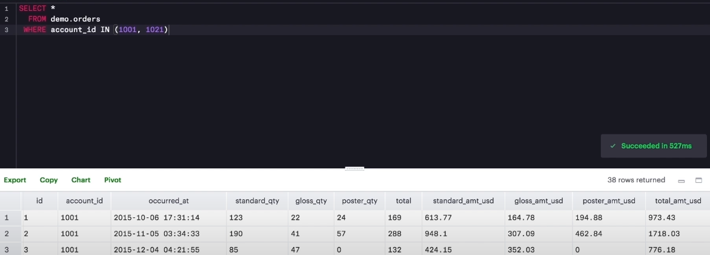


### NOT
The NOT operator is an extremely useful operator for working with the previous two operators we introduced: IN and LIKE. By specifying NOT LIKE or NOT IN, we can grab all of the rows that do not meet particular criteria.


### AND and BETWEEN

**BETWEEN Operator**
Sometimes we can make a cleaner statement using **BETWEEN** than we can use **AND**. Particularly this is true when we are using the same column for different parts of our **AND** statement. In the previous video, we probably should have used **BETWEEN**.


```SQL
SELECT *
FROM web_events
WHERE channel IN ('organic', 'adwords') AND occurred_at BETWEEN '2016-01-01' AND '2017-01-01'
ORDER BY occurred_at DESC;
```

### OR

Sử dụng ngoặc để kết hợp AND với OR


### Lession recap

**Commands**
You have already learned a lot about writing code in SQL! Let's take a moment to recap all that we have covered before moving on:

*Note: BETWEEN và IN có lấy điều kiện biên


## SQL Join

So above, we understand that all of the information related to an account is not in the orders table, but why not? Watch the below video to find out!


Có thể thấy 1 bảng thì thông thường chỉ cần thay đổi thông tin, số lượng hàng không thay đổi, còn 1 bảng thì cần thêm hàng liên tục khi người dùng mua thêm nhiều đơn mới, nên cần thiết tách thành bảng riêng để dễ dàng quản lý.


*Note: Nếu gộp bảng một cách không khoa học, thì khi thông tin của 1 người dùng bị thay đổi, cần cập nhật ở rất nhiều hàng, dẫn tới việc tốn kém xử lý

### JOIN


Joining tables allows you access to each of the tables in the SELECT statement through the table name, and the columns will always follow a . after the table name.

Now it's your turn.


### JOIN AND FILTER


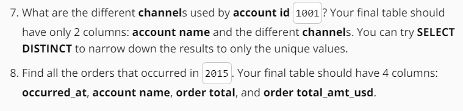


## Aggregation


Không có dữ liệu, bị xóa hoặc thiếu thông tin, khi cần liên lạc thì không có thông tin để liên hệ


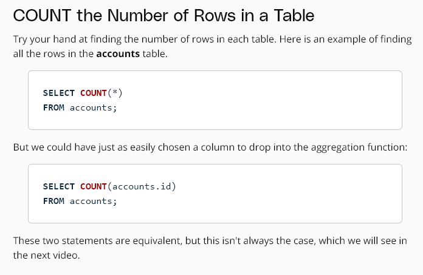


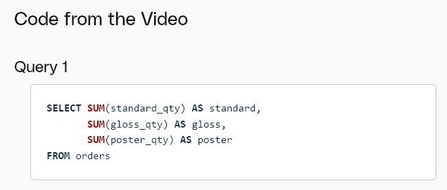


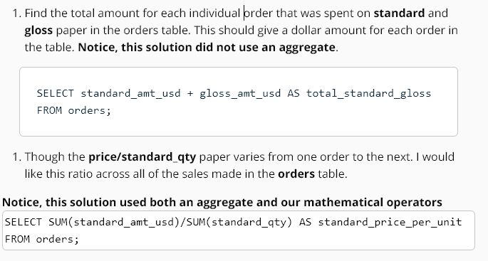


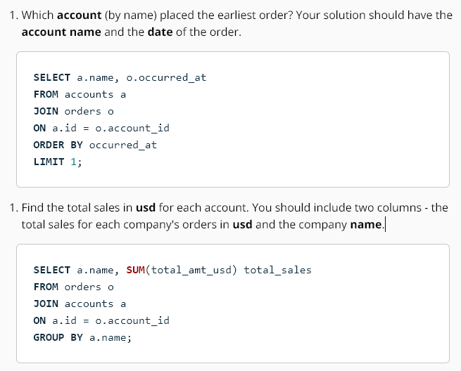


Day of the week


Mô tả lại sẽ clear hơn và giống với lable hơn
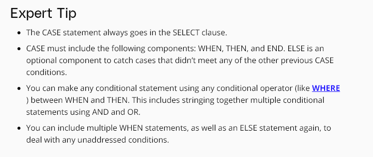


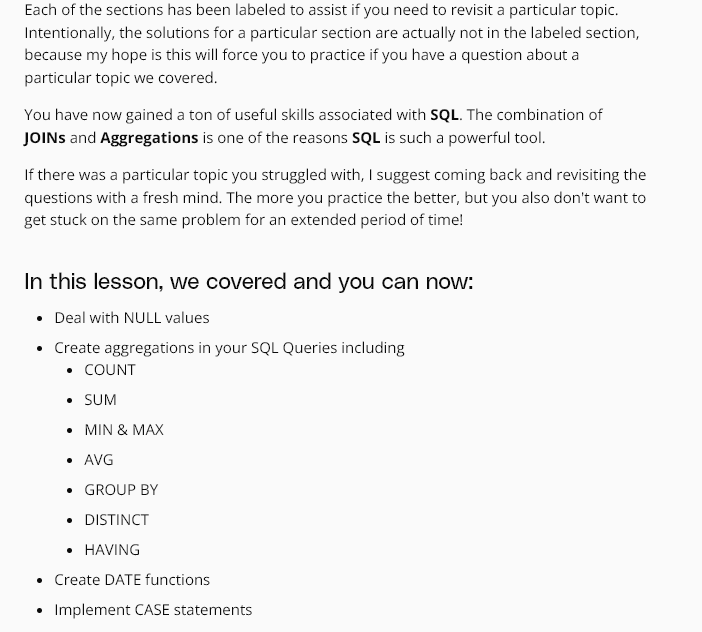
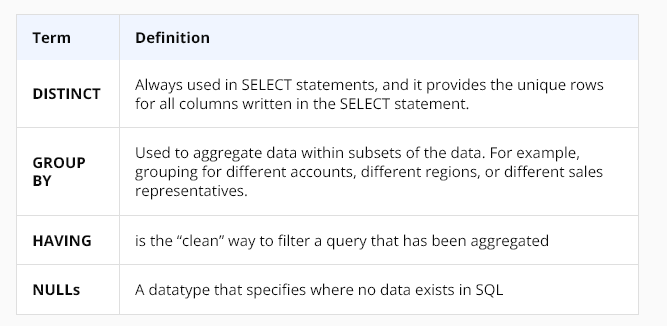

## Subqueries
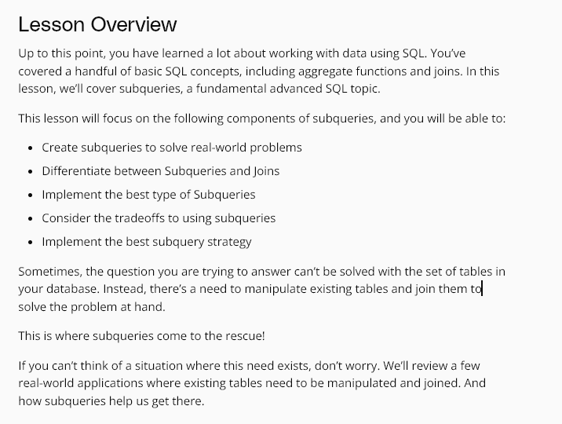


take a stab at this quiz: hãy đâm 1 nhát vào bài quiz này haha


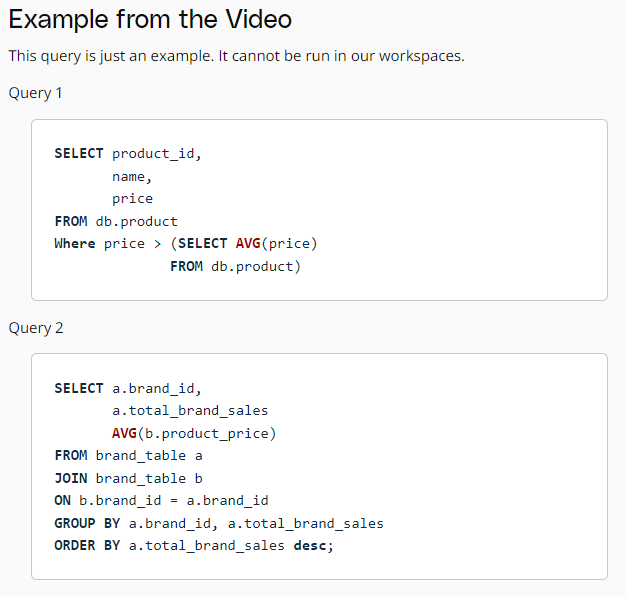


caveat -> cảnh báo


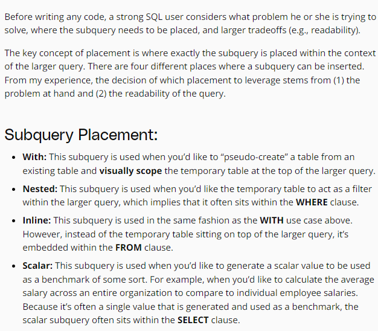
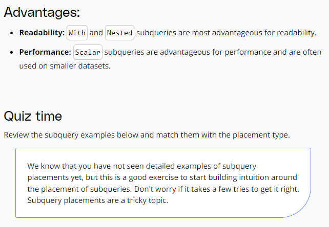


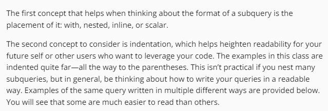


